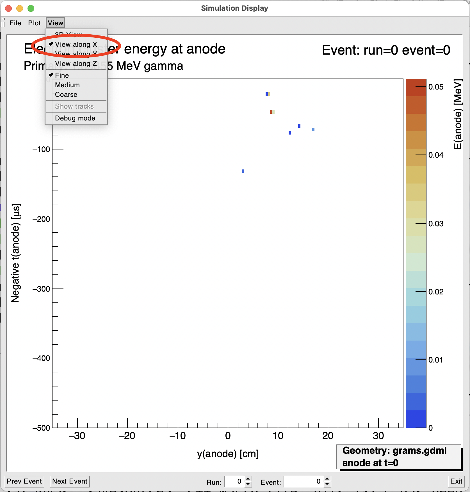
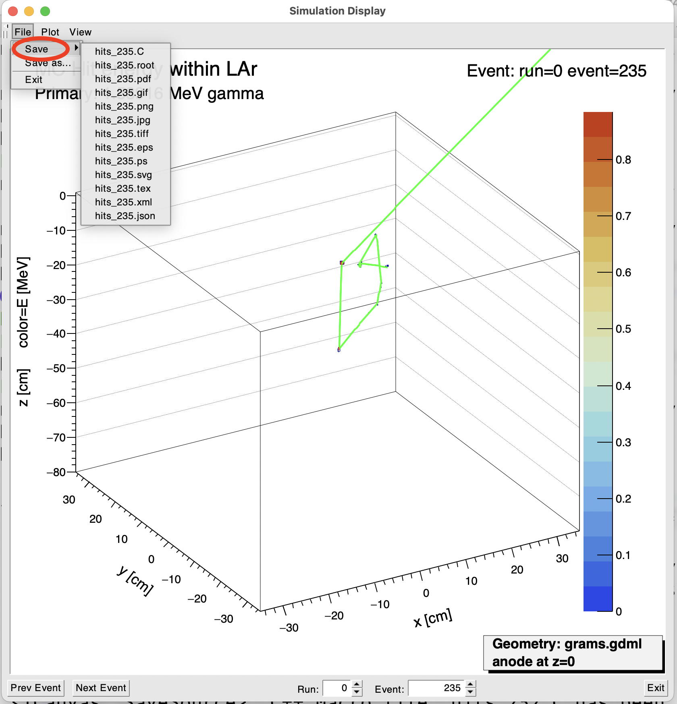

# GramsSim display programs
*Principle Maintainer: [William Seligman](https://github.com/wgseligman)*

_If you want a formatted (or easier-to-read) version of this file, scroll to the bottom of [`GramsSim/README.md`](../README.md) for instructions. If you're reading this on github, then it's already formatted._

- [GramsSim display programs](#gramssim-display-programs)
  * [`simd`](#simd)
    + [Invoking `simd`](#invoking-simd)
      - [The basic command](#the-basic-command)
      - [`simd` inputs](#simd-inputs)
      - [Changing the defaults](#changing-the-defaults)
    + [Using `simd`](#using-simd)
      - [Overall](#overall)
      - [Electron-cluster energies](#electron-cluster-energies)
      - [LAr Hits](#lar-hits)
      - [MC Tracks](#mc-tracks)
      - [Readout channel energies](#readout-channel-energies)
      - [ADC counts](#adc-counts)
      - [x-, y-, and z-views](#x-y-and-z-views)
      - [Binning](#binning)
      - [Navigating events](#navigating-events)
      - [Saving a plot](#saving-a-plot)
    + [Warnings](#warnings)
      - [Speed issues](#speed-issues)
      - [User-interface issues](#user-interface-issues)
      - [Consistency between files](#consistency-between-files)
    + [`simd` code tips](#simd-code-tips)
      - [Making the histograms](#making-the-histograms)
      - [Understanding the graphics widgets](#understanding-the-graphics-widgets)

<small><i><a href='http://ecotrust-canada.github.io/markdown-toc/'>Table of contents generated with markdown-toc</a></i></small>

The `GramsSim/Display` directory contains programs used to display results of the simulation. As of Aug-2024, there's just one: `simd`.

## `simd`

`simd` is short for "Simulation Display". It shows histograms of key values that come from the main stages of [GramsSim](../README.md).

- `simd` is _not_ an event display. It does not show the detector geometry. The "boxes" that you see in the plot are histograms, not images of the LArTPC. 

- The main purpose of this tool is to understand the simulation, diagnose problems, and improve our understanding of the detector. It might be useful for making plots for publication, but that's not its focus. 

### Invoking `simd`

#### The basic command

In your build directory (`GramsSim-work` if you followed the [installation directions exactly](../README.md)), try just typing this:
```
./simd
```

#### `simd` inputs

If you don't modify the GramsSim options, either in [the Options xml file](../util/README.md) or on the command line, the files created by a complete run of the simulation chain are (as of Aug-2024):

```
gramsg4.root
gramsdetsim.root
gramsreadoutsim.root
gramselecsim.root
```

If you just type this command, `simd` will read those files by default and display plots:
```
./simd
```

#### Changing the defaults

`simd` gets these filenames and other parameters from [`options.xml`](../options.xml). If you'd like to see plots from a different combination of files, you can modify `options.xml` and just run `simd`. 

If you're doing several different runs of the simulation chain with different sets of files, you can either:

- Create several Options XML files. `simd` accepts options on the command line [in the same way as the main GramsSim programs](../util/README.md), so you can give an alternate options file as an argument to the command; e.g.,

      ./simd options-other.xml
      
- You can specify the names of all the files created by the simulations chain on the command line, overriding the values in `options.xml` [as you can with the main GramsSim programs](../util/README.md); e.g.,

      ./simd \
          --outputG4File=g4-other.root \
          --outputDetSimFile=detsim-other.root \
          --outputReadoutFile=readout-other.root \
          --outputElecFile=elecsim-other.root

  This second approach is more verbose, but it may be useful in some cases. 
          
  The above example assumes that all other options are the same as those found in `options.xml`. For example, `simd` gets the name of the original GDML geometry file from option `gdmlfile`. If you're running GramsSim multiple times  with different geometries, while you can add `--gdmlfile=geometry-other.gdml` to the `simd` command line, the first approach is probably the better one to take. 
  
  
### Using `simd`

#### Overall 

All of these plots are generated using standard ROOT graphics. The graphics elements for individual plots can be edited and saved using standard ROOT techniques (see the [Nevis ROOT tutorial](https://www.nevis.columbia.edu/~seligman/root-class/html/basics/index.html) for some tips).

In particular, you can rotate the 3D histograms by dragging on the central "cube" with a mouse. 

#### Electron-cluster energies

When you start `simd`, you'll see a view that looks something like this. Note that the details will differ depending on the contents of the GramsSim output files. 

|  |

As of Sep-2024, the initial view will show a 3D plot of electron-cluster energies versus cluster arrival time at the anode. 

#### LAr Hits

To see the energy deposits due to ionization in the LAr (the "hits"), select *LAr MC Hits* from the **Plot** menu:

|  |

#### MC Tracks

To see the original particle tracks that are the source of the hits, select *MC Tracks* from the **Plot** menu:

|  |

The convention is the same as that of [GramsG4 user-interface view](../mac/README.md): green is used for neutral particles; red for negatively-charged particles; blue for positively-charged particles. At the scale of the plot, the red tracks for Compton scatters may be invisible. 

What can be more useful is to see the MC tracks superimposed on the hits. To see this, select *LAr MC Hits* from the **Plot** menu, and select the *Show Tracks* option from the **View** menu:

|  |

#### Readout channel energies

To view the energy deposited versus readout channel, select *Energy in Readout Channels* from the **Plot**

|  |

The number of x-y bins shown in the Electron Clusters plot is the same as the number of readout channels in this plot. Therefore, as of Sep-2024, the Electron Clusters plot and the Readout Channels plot will look identical except for the axis labels. 

#### ADC counts

To view the ADC counts in each readout channel, select *ADC counts in Readout Channels* in the **Plot** menu.

|  |
 
**Warning:** As of Sep-2024, the number of ADC bins in each readout channel is 3000. This means that, for the 3D view, there's going to be a long delay (tens of seconds) to draw the ADC-counts plot (the total number of bins in that 3D histogram is 150\*150\*3000). Whether there will continue to be that many ADC bins in each channel will depend on the parameters given to [GramsElecSim](../GramsElecSim).

#### x-, y-, and z-views

The 3D views can be useful, but it can also be useful to look at the same information collapsed into a 2-D plots. You can select views along the x-, y-, and z-axis from the **View** menu:

|  |

#### Binning

Although most of the plots include a color palette to show the amount of energy within a histogram bin, often the bins are so small that the colors are not easy to distinguish. In case it's useful, you can select the degree of binning from the **View** menu:

|  |

*Fine* binning is the default. *Medium* binning groups two adjacent bins along each axis of the plot. *Coarse* binning groups four adjacent bins (compared to *Fine* binning).

#### Navigating events

There are multiple ways to navigate between events in `simd`.

|  |

One way is to click on the *Prev Event* and *Next Event* buttons in the lower left-hand corner of the display.

Another is to click on the up- and down-arrow buttons in the *Event* field in the bottom middle right of the display. (You can also click on the corresponding buttons in the *Run* field, but by default [GramsG4](../GramsG4) generates all events with Run number 0.)

You can also directly type an event number into the *Event* field and hit the Enter/Return key. 

#### Saving a plot

If you want to save a given plot, use the **File** menu:

|  |

The *Save* sub-menu within **File** will show a list of file names and types based on the plot type and event number. This is to make it easier for a user to save many images from a given run of the simulation.

If none of the file names are suitable, use *Save As...* from the **File** menu. It will open a standard dialog box in which you can type a file name. ROOT will automatically select the appropriate file type based on the file name's extension; e.g., if you type `myEvent.C` the plot will be saved as a ROOT macro. 

### Warnings

#### Speed issues

As noted above, as of Sep-2024 the ADC counts plot is slow. 

There's a more general speed problem when the program is run remotely. When run from a GramsSim installation on a Mac, the transition between plots is almost instant (except for the ADC plot as noted above). When run remotely (i.e., you run `simd` on a remote server and view the X display using a tool such as [XQuartz](https://www.xquartz.org/) or [mobaxterm](https://mobaxterm.mobatek.net/)) the plots can take quite a long time to draw.

If you can, try to [install](../DEPENDENCIES.md) GramsSim on your laptop. You can run `simd` using ROOT files generated on a remote server; don't forget to copy any custom [options.xml](../options.xml) files you created. 

#### User-interface issues

If you are running `simd` on your laptop, the following keys should be recognized:

   - The left- and right-arrow keys move to the previous and next event in the input files, respectively. 
   
   - The up- and down-arrow keys move up and down the list of types of plots in the **Plot** menu. It's a cyclic display; if you press the down-arrow while viewing the ADC counts plot the display will shift to the MC Tracks plot. 
   
If you're running `simd` remotely, the arrow keys probably will not work. 

If you type a number in the Event field at the bottom of the display and hit Enter, you'll be taken to that event. If you then click on the small up- and down-arrow buttons in that field, the displayed event number within the Event widget will change in unpredictable ways, but the actual event that you'll see will be the previous or next event as you expect. 

**IMPORANT**

When using `simd`, look carefully at the axes and their labels. They were chosen so that the visual location of the anode matches that of the physical detector. That doesn't always match with the physical value of the variable in the z-axis; in many of the plots you'll see "negative z" to reflect this.

The ideal solution would be to reverse the axis somehow. Unfortunately, while ROOT has an *ad hoc* mechanism for reversing the axis of a 2D mechanism, there's no such method for a 3D histogram.

#### Consistency between files

In order for `simd` to display a consistent set of plots, it must be supplied with a consistent set of GramsSim input files. As of Sep-2024, a "set" of such files are the outputs of:

```
GramsG4
GramsDetSim
GramsReadoutSim
GramsElecSim
```

All these output files must be available, either via an [options.xml](../util) file or on the command line as shown above. 

To pick an extreme example of a set-up that won't work, if you generate events use [`gramsg4`](../GramsG4) for the [pGRAMS geometry](../pgrams.gdml) but the other three files are from a prior run of GramsSim using the ["future GRAMS" geometry](../gramsgdml), then the histograms you see in `simd` won't work.

This does not necessarily mean that you have to regenerate all four files to work with `simd`. For example, assume you're doing a study that's just varying the parameters for [`gramselecsim`](../GramsElecSim). Perhaps it might look something like:

    ./gramselecsim --bit_resolution=10 -o elec_bit_10.root
    ./gramselecsim --bit_resolution=12 -o elec_bit_12.root
    
Then you could run `sim` with just the changed output file, assuming that all other parameters in `options.xml` are unchanged; e.g.,

    ./simd --outputElecFile=elec_bit_10.root
    ./simd --outputElecFile=elec_bit_12.root

### `simd` code tips

This section is meant for those who want to examine the [code](./src/SimulationDisplay.cc) for `simd`. 

The files [simd.cc](./simd.cc), [SimulationDisplay.h](./include/SimulationDisplay.h), and [SimulationDisplay.cc](./src/SimulationDisplay.cc) can be intimidating, even with the comments. Hopefully the following two sub-sections will make it easier for you. 

#### Making the histograms

If you want to look at the code to learn how to read the input files to make histograms, you'll want to focus on these routines within [SimulationDisplay.cc](./src/SimulationDisplay.cc):

```c++
  // Routines associated with accumulating values from the ROOT
  // tree.
  void FindPrimaries();
  void AccumulateHits();
  void AccumulateClusters();
  void AccumulateReadout();
  void AccumulateWaveforms();
```

```c++
  // The routines for creating different histograms for different
  // views and kinds. 
  TH1* HistogramView3D();
  TH1* HistogramViewX();
  TH1* HistogramViewY();
  TH1* HistogramViewZ();
  void AddPlotLines();
  void AddTrackLines();
```

```c++
  // Update the canvas with current histogram view.
  void UpdateDisplay();
```

Everything else has to do with the implementation of the graphics widgets.

#### Understanding the graphics widgets

Like most ROOT-based user interfaces, the code for `simd` is a big monolithic block that's hard to break down into smaller chunks. The following web pages may help you understand what it takes to implement a graphics widget (a button, menu item, dialog box, etc.) using ROOT:

   - [ROOT manual chapter on writing a GUI](https://root.cern/root/htmldoc/guides/users-guide/WritingGUI.html)
   
   - The tutorial examples in `$(root-config --tutdir)/gui/`
   
     The author of `simd` continually referred to these examples, using the [grep](https://www.geeksforgeeks.org/grep-command-in-unixlinux/) utility to search files, and referring to the [ROOT Reference Guide](https://root.cern/doc/v632/annotated.html) for the details.
     
In particular, note that to create a stand-alone GUI application using ROOT, one must generate a dictionary (as described [here](https://root.cern/root/htmldoc/guides/users-guide/WritingGUI.html)) using a [LinkDef file](./include/LinkDef.hh) and a [CMakeList.txt specification](./CMakeLists.txt). 
   
