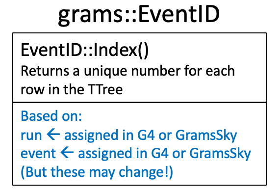
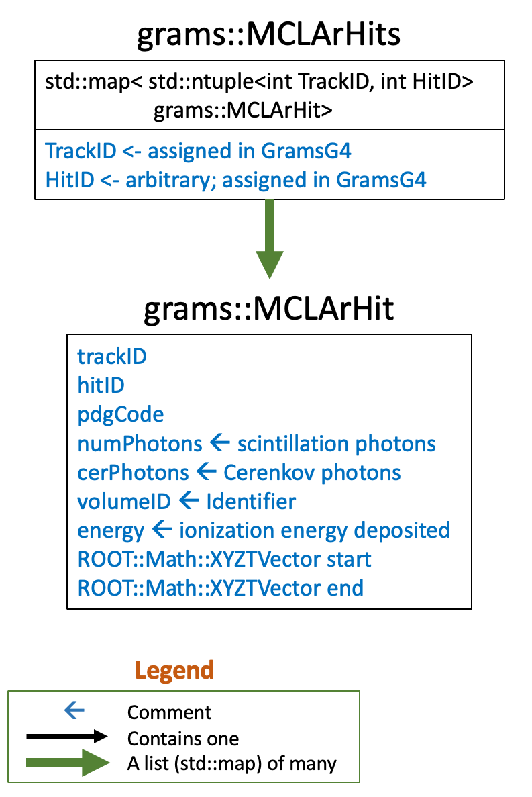

# Data Objects

A "data object" is a C++ type (class, struct, etc.) that is written as
a Branch (column) of a [TTree][10] (n-tuple) in a ROOT file.

[10]: https://root.cern.ch/doc/master/classTTree.html

## Overview

|  |
| :-----------------------------------------------------------: | 
| <small><strong>How the `GramsSim` files, trees, and data objects are connected.</strong></small> |

### Definitions

The data objects are defined by header files in [the GramsDataObj/include/
directory](./include). If any implementations are needed, they're
either in `.icc` files in the `include/` directory or in `.cc` files
in [the src/ directory](./src).

### Linkdef.hh

Because of the way [ROOT dictionary generation][70] works, the single
[Linkdef.hh](./include/LinkDef.hh) file must include the necessary
`#pragma` definitions for every data object. If you add a new data
object, be sure to edit this file.

[70]: https://root.cern/manual/io_custom_classes/

### Operators

Each data object should include an overloaded [operator<<][20],
whether it's a class, struct, or list. This means that the object can
be displayed easily in C++. For example:

[20]: https://en.cppreference.com/w/cpp/language/operators

```c++
   auto tracklist = new grams::MCTrackList();
   // Assign values to (*tracklist), then:
   std::cout << *tracklist << std::endl;
```

Some of the data objects are lists ([std::set][30],
[std::multiset][40], [std::map][50], etc.). Others are C++ types such
as `struct` or `class`. For the non-list types, an explicit or
implicit [operator<][60] is defined. This means that these objects can be
sorted, or used as keys in sorted containers like `std::set`.

[30]: https://cplusplus.com/reference/set/set/
[40]: https://cplusplus.com/reference/set/multiset/
[50]: https://cplusplus.com/reference/map/map/
[60]: https://en.cppreference.com/w/cpp/language/operators

### Trees containing data objects

Each of the main TTrees produced by the analysis programs have the following properties:

#### Friendly trees

Each tree has one row for each value of `grams::EventID` (see below). They're all in sync
row-for-row; if row 2345 in TTree `gramsg4` refers to a given event,
row 2345 in TTree `DetSim` refers to the same event.

The standard ROOT method for working with multiple TTrees with related
rows, but different columns, is to use [friend trees][80]. This is a
way of "adding columns" to a tree without modifying the original file.

[80]: https://root.cern/manual/trees/#widening-a-ttree-through-friends

For example, consider tree `gramsg4` in file `gramsg4.root` and tree
`DetSim` in file `gramsdetsim.root`. To process both trees at
once:

```c++
  // Open the first file and its tree.
  auto myFile = TFile::Open("gramsdetsim.root");
  auto tree = myFile->Get<TTree>("DetSim");

  // Declare that the gramsg4 tree is a friend to the DetSim tree.
  tree->AddFriend("gramsg4","gramsg4.root");

  // Define the TTreeReader for this combined tree.
  auto reader = new TTreeReader(tree);

  // Create a TTreeReaderValue for each column in the combined tree
  // whose value we'll use. Note that we have multiple columns named
  // "EventID" in the combined tree, so specify which one to use.

  // TTReaderValue behaves like a pointer. For example, we'll have to
  // use (*EventID) later in the code.
  
  TTreeReaderValue<grams::EventID>          EventID  (*reader, "ElecSim.EventID");
  TTreeReaderValue<grams::MCLArHits>        Hits     (*reader, "LArHits");
  TTreeReaderValue<grams::ElectronClusters> Clusters (*reader, "ElectronClusters");

  // For every event in the combined tree:
  while (reader->Next()) {

    // Do whatever with *EventID, *Hits, and *Clusters.
  }
```

#### Indexed trees

Each TTree has a [grams::EventID](./include/EventID.h) column, to help
make sure the trees maintain their row-to-row correspondence. Each tree
also has an [index][90] based on the `EventID`. When processing a
TTree, typically one reads the rows (entries) sequentially.

[90]: https://root.cern/doc/v608/classTTreeIndex.html#a02300b69681c45b9e20503ad1d86d8c8

For example, to read the data product
[MCTrackList](./include/MCTrackList.h), one might do:

```c++
 // Define the input file.
  auto input = new TFile("gramsg4.root");

  // Define which TTree to read.
  TTreeReader myReader("gramsg4", input);

  // Define which variable(s) we'll read. This behaves like a pointer;
  // in the code we'll use "*tracklist". 
  TTreeReaderValue<grams::MCTrackList> tracklist(myReader, "TrackInfo");

  // For each row in the TTree:
  while (myReader.Next()) {

    // ... do something with *tracklist ...

  }
```

However, if you want to read a specific row in the TTree, you can use
the index. For these trees, the index is defined using
`grams::EventID::Index()`. For example, if you know that you want to
look at the specific event "Run=0, Event=1234", instead of looping
with `myReader.Next()` as in the above example, you could do:

```c++
  // Define the input file.
  auto input = new TFile("gramsg4.root");

  // Define the input tree and branch:
  TTree* myTree = input->Get<TTree>("gramsg4");;
  auto tracklist = new grams::MCTrackList();
  myTree->SetBranchAddress("TrackList",&tracklist);

  // Select a particular row:
  grams::EventID myEvent(0,1234);
  myTree->GetEntryWithIndex( myEvent.Index() );

  // ... at this point, (*tracklist) is the list of tracks for run=0, event=1234
```

The advantage of this approach is it uses the index to access that
portion of the input file directly, instead of sequentially searching
for a given entry.

_As noted below, if we start using some other way to identify events 
other than run/event numbers, then the above code must be modified._


### Maps and keys

In C++, a [std::map][130] is a container whose elements are stored in (key,value) pairs.
If you're familiar with Python, they're similar to [dicts][140]. 

[130]: https://cplusplus.com/reference/map/map/
[140]: https://www.w3schools.com/python/python_dictionaries.asp

Many of the data objects described below are organized in the form of maps, with keys
in the form of a [std:::tuple][120]. For example, in [MCLArHits.h](./MCLArHits.h):

[120]: https://en.cppreference.com/w/cpp/utility/tuple

```c++
// map<key, MCLArHit>. where the key is std::tuple<trackID,hitID>.
typedef std::map< std::tuple<int,int>, MCLArHit > MCLArHits;
```

This is to make it easier to do "back-tracing" of objects that are
located in different columns/branches in different trees. For example,
assume you are going through ElectronClusters and you wish to examine the
LArHit that the cluster came from:

```c++
auto mcLArHits = new grams::MCLArHits();
auto clusters = new grams::ElectronClusters();
// Assume you've read *mcLArHits and *clusters from
// their respective friend trees.

// For every cluster in the map
for ( const auto& [key, cluster] : (*clusters) ) {
   // Look at the fields of the cluster's key:
   const auto& [ trackID, hitID, clusterID ] = key;

   // Then the key for the corresponding hit that
   // contains that cluster is:
   const auto hitKey = std::make_tuple( trackID, hitID );

   // This is the hit that the cluser is in:
   const auto hit& = (*mcLArHits)[ hitKey ];
}
```

This is illustrated in greater detail in [GramsSim/scripts/AllFilesExample.cc](../scripts/AllFilesExample.cc). 


## Data objects

### grams::EventID

The [EventID](./include/EventID.h) object encapsulates what, in many
experiments, is simply the run and event number. However, in a balloon
or satellite experiment, it may be that there are different methods
for assigning an event ID; e.g., UTC time.

As a precaution (and also to saving on typing `if (run == N && event
== M)`), the `grams::EventID` class is used instead. You can sort on
`grams::EventID` or test it for equality, without having to modify the code
if there's a switch from "run/event" to distinguish events.

|  |
| :---------------------------------------------------------: | 
| <small><strong>Sketch of the grams::EventID data object.</strong></small> |

The `grams::EventID` object is created in [GramsG4](../GramsG4), then copied 
from one file to another as the friend trees are created in subsequent programs
in the analysis chain (such as [./GramsDetSim](./GramsDetSim)).

### grams::MCTrackLists

This data object contains the "MC Truth" information for the particle tracks produced
in [GramsG4](../GramsG4); see that page for additional information. 

|  |
| :-----------------------------------------------------------------: | 
| <small><strong>Sketch of the grams::MCTrackLists data object.</strong></small> |

### MCLArHits

This data object contains the "MC Truth" information associated with the ionization energy deposits in the liquid argon as determined by [GramsG4](../GramsG4); see that page for additional information. 

|  |
| :--------------------------------------------------------------: | 
| <small><strong>Sketch of the grams::MCLArHits data object.</strong></small> |


### grams::MCScintHits

This data object contains the "MC Truth" information for ionization energy deposited in the scintillator strips by the [GramsG4](../GramsG4) simulation; see that page for additional information. 

|  |
| :----------------------------------------------------------------: | 
| <small><strong>Sketch of the grams::MCScintHits data object.</strong></small> |

### grams::ElectronClusters

This data object contains electron-cluster information produced by [GramsDetSim](../GramsDetSim), which models the drift of the ionization deposited in the LAr as recorded in MCLArHits; see the `GramsDetSim` page for additional information. 

|  |
| :------------------------------------------------------------: | 
| <small><strong>Sketch of the grams::ElectronClusters data object.</strong></small> |

### grams::ReadoutMap

This data object, created by [GramsReadoutSim](../GramsReadoutSim), contains the association of the electron clusters created in [GramsDetSim](../GramsDetSim) to the elements of the readout geometry. See the `GramsReadoutSim` page for additional information. 

|  |
| :------------------------------------------------------------: | 
| <small><strong>Sketch of the grams::ReadoutMap data object.</strong></small> |

### grams::ReadoutWaveforms

This data object is created by [GramsElecSim](../GramsElecSim). It contains the analog and digital waveforms for the elements of the readout geometry as induced by the electron clusters in `grams::ElectronClusters` and mapped to the readout by `grams::ReadoutMap`. See the `GramsElecSim` page for additional information. 

|               |
|                                 :--------:                                         | 
| <small><strong>Sketch of the grams::ReadoutWaveforms data object.</strong></small> |
