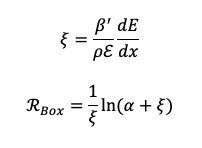
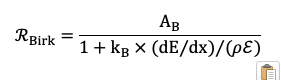
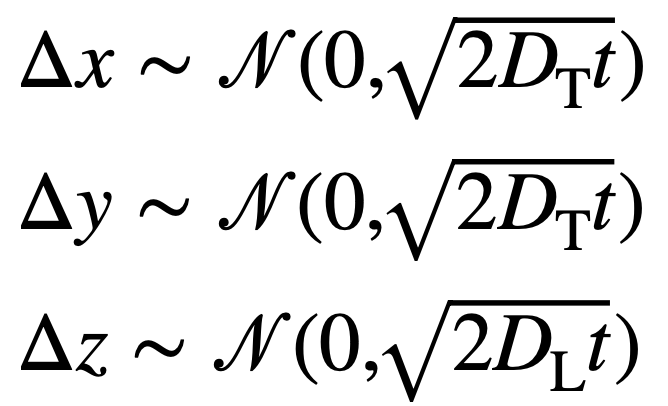
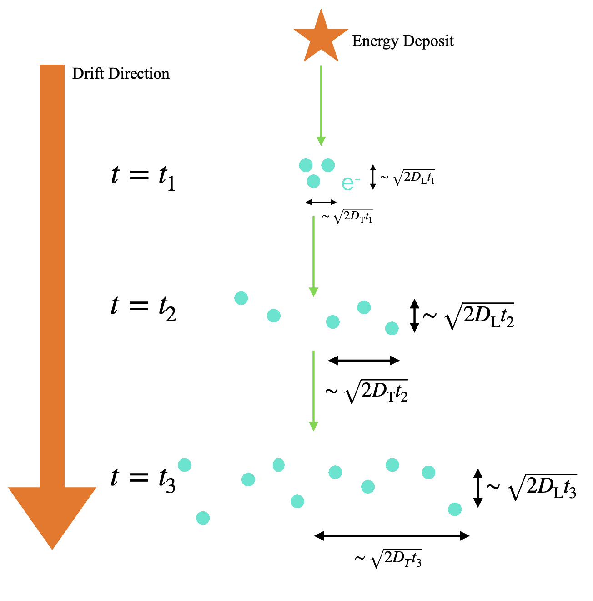

# GramsDetSim
*Principle author: Satoshi Takashima*

_If you want a formatted (or easier-to-read) version of this file, scroll to the bottom of [`GramsSim/README.md`](../README.md) for instructions. If you're reading this on github, then it's already formatted._

- [GramsDetSim](#gramsdetsim)
  * [Overview](#overview)
  * [Running `GramsDetSim`](#running-gramsdetsim)
  * [Detector-response functions](#detector-response-functions)
    + [Recombination](#recombination)
    + [Absorption](#absorption)
    + [Diffusion](#diffusion)
  * [grams::ElectronClusters](#gramselectronclusters)
  * [Design note](#design-note)

<small><i><a href='http://ecotrust-canada.github.io/markdown-toc/'>Table of contents generated with markdown-toc</a></i></small>

[`GramsG4`](../GramsG4) propagates particles as they pass through the
detector, recording the amount of ionization they deposit in the
liquid argon. The next step in modeling the detector is to propagate
that ionization to the GRAMS readout.

In theory, one might set up Geant4 to transport each individual
electron liberated by ionization to the readout plane. In practice,
this would take too long. Instead, we use `GramsDetSim` to model the
drifting of the ionization electrons in the LArTPC.

Note that this program does _not_ model the effects of the readout geometry or electronics. That's handled in a subsequent step. 

## Overview

Like the other [GramsSim](../) programs, `GramsDetSim` uses the
[`options XML file`](../util/README.md) to control its processing. The
parameters that control the program are under active development, so
it's a good idea to read the file [`options.xml`](../options.xml) and
pay attention to the comments.

In particular, many of the parameters used in the models described
below depend on the choice of units. It's up to you to make sure that
that units used for (e.g.,) option `birks_kB` match the options
`LengthUnit`, `TimeUnit`, and `EnergyUnit` at the top of the XML file.

## Running `GramsDetSim`

From your project build directory (see
[`GramsSim/README.md`](../README.md)) you can run this program with

```
./gramsdetsim
```

This program will read in a file created by the [`GramsG4`](../GramsG4)
simulation and create a friend tree, adding a column of 
[ElectronClusters](../GramsDataObj/include/ElectronCluster.h) data objects, described below. See 
[GramsDataObj/README.md](../GramsDataObj/README.md) for a detailed description of "friend trees".

See [GramsSim/util/README.md](../util/README.md) for a description of how to control the
operation of `gramsdetsim` through the [`options.xml`](../options.xml) file and the
command line.

Note that the diffusion model (described below) makes use of a random-number generator.
If you're running `gramsdetsim` as part of a cluster of jobs, you probably want
to include a random-number seed on the command line as described [`GramsG4`](../GramsG4); e.g.,

    ./gramsdetsim --rngseed=${process}

## Detector-response functions

Again recall that the parameters for all of the following functions can be found in the [`options.xml`](../options.xml) file. 

### Recombination

"Recombination" is a model of the effects of electrons returning to
atoms after being liberated through ionization.

As of Sep-2022, the recombination models and parameters used in GramsDetSim are based
on these papers:

- [A study of electron recombination using highly ionizing
particles in the ArgoNeuT Liquid Argon TPC][10]

- [Study of electron recombination in liquid argon with the ICARUS TPC][11]. 

[10]: https://arxiv.org/abs/1306.1712
[11]: https://www.sciencedirect.com/science/article/pii/S0168900204000506

The specific recombination model is selected by the parameter `RecombinationModel` in [`options.xml`](../options.xml). That parameters selects between two functional forms:

- Modified box model



- Birk's model



where:

- _&beta;'_, _&alpha;_, A<sub>B</sub>, and k<sub>B</sub> are material- and detector-based parameters that must be measured empirically;

- _&epsilon;_ is the electric field;

- _&xi;_ is the effective electric field;

- _&rho;_ is the density of the liquid argon;

- dE/dx is the ionization energy per unit length.

(Note: Here, dE/dx is the quantity computed in the program code, that is, energy per unit length. In the papers referenced above, dE/dx is the "stopping power", defined as deposited energy divided by material density per unit length. To go from one to the other, (1/_&rho;_)(dE/dx)<sub>code</sub> = (dE/dx)<sub>papers</sub>.)

See the [options XML](../options.xml) file for the values of the
individual parameters.

### Absorption

Absorption models the effects of ionized electrons being absorbed by
impurities in the liquid argon (such as oxygen and water) as the
electrons drift towards the anode of the TPC.

As of Sep-2022, the absorption model in the code is:


where

- s<sub>drift</sub> = the drift distance between the ionization hit in the TPC to the anode;

- v<sub>drift</sub> = the drift velocity;

- t<sub>elec</sub> = the electron lifetime in the liquid argon. 

v<sub>drift</sub> and t<sub>elec</sub> are detector- and material-dependent parameters, whose values are found in the `options.xml` file.

### Diffusion

Diffusion models the spread of the ionization electrons as they drift towards the anode. 

The procedure is to convert the ionization energy to a number of
electrons. The electrons are grouped into clusters, to save time. Then
each cluster is randomly shifted in both the transverse and
longitudinal directions of the drift.

The spread of the electron clusters is given by:



where _N(a,b)_ is a normal distribution with a mean of _a_ and a width of _b_, and _D_<sub>T</sub> and _D_<sub>L</sub> are parameters supplied in the `options.xml` file. 

This is a sketch of the procedure:

|  |
| :---------------------------------------: | 
| <small><strong>Sketch by Satoshi Takashima of the operation of `GramsReadoutSim`. Note the separate values for <i>D<sub>L</sub></i> and <i>D<sub>T</sub></i>, the longitudinal and traverse diffusion respectively. </strong></small> |

## grams::ElectronClusters

As you look through the description below, consult the [GramsDataObj/include](../GramsDataObj/include) directory for the header files. These are the files that define the methods for accessing the values stored in this object. Documentation may be inaccurate; the code is actual definition. If it helps, a [std::map][130] is a container whose elements are stored in (key,value) pairs. If you're familiar with Python, they're similar to [dicts][140]. 

[130]: https://cplusplus.com/reference/map/map/
[140]: https://www.w3schools.com/python/python_dictionaries.asp


|  |
| :------------------------------------------------------------: | 
| <small><strong>Sketch of the grams::ElectronClusters data object.</strong></small> |

The [`grams::ElectronClusters`](../GramsDataObj/include/ElectronClusters.h) data object contains all of the electron-cluster information for an event. `ElectronClusters` is a [map][130] containing `grams::ElectronCluster` objects. 

The value of "ClusterID" is completely arbitrary. It's assigned within GramsDetSim for purposes of "backtracking" through the GramsSim analysis chain. In particular, do not assume any kind of time ordering based on ClusterID; ClusterID==0 does not imply that it's the first or earliest electron cluster created for a hit. 

GramsDetSim groups electrons into clusters whose size is given by the `ElectronClusterSize` parameter in [`options.xml`](../options.xml). There are usually some electrons remaining, which are assigned to the last cluster for a given HitID. This means that if you examine the sequence of `grams::ElectronCluster` objects for a given HitID, the `energy` and `numElectrons` fields will be the same for all but the last one in the sequence; that cluster contains the remaining electrons after the total number of electrons is divided into groups of size `ElectronClusterSize`.

The `position` field within `grams::ElectronCluster` contains the _(x,y,t)_ values of the cluster at the readout anode, in units given by the parameters in the `<global>` section of [`options.xml`](../options.xml). The _z_-coordinate is the exception; since its value would always be 0 (the origin of the _z_-axis in the detector geometry is the anode), instead `position.Z()` contains the _z_-position of the cluster when it was first generated.


## Design note

It's reasonable to ask why the functions of GramsDetSim,
GramsReadoutSim, and GramsElecSim are in three separate programs.

Functionally, each of these programs relates to a different aspect of
an experiment's simulation:

   - GramsDetSim relates to the physics of charge transport in the detector.

   - GramsReadoutSim relates to the geometry of the readout anode.

   - GramsElecSim relates to the design of the data-acquisition electronics.

Experience has taught us that for the purpose of planning, testing,
studies, and maintenance, it's best to have these functions in
separate programs, rather than one large program.
