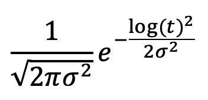
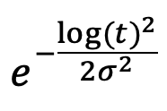
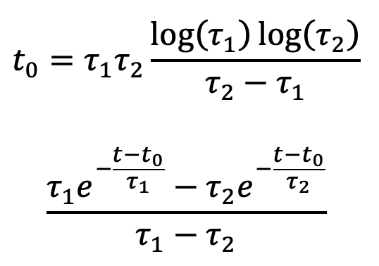

# GramsElecSim
*Author: Satoshi Takashima*

This program is a simulation of the electronics response to the detector readout, including noise and shaping. It sums the energy deposited into each readout pixel as a function of time, and generates waveform simulations for each pixel. 

Note that `gramselecsim` uses a random-number generator for its noise and pre-amp operations. When running this program as part of grid or batch job, you probably want to set up a process-based value for option `rngseed` as mentioned in [GramsSim/README.md](../README.md). For example, assuming that the individual process ID is stored in variable `${Process}`:

    ./gramselecsim --rngseed=${Process}
    
## `GramsElecSim` simulations

Overall parameters:

- `timebin_width`: The minimal time interval over which the readout can can respond to a charge.

- `time_window`: The total time interval over which charge would be sampled once the electronics are triggered. 

The output of `gramselecsim` includes both the analog and digital versions of the waveforms created by summing the charges accumulated at each readout pixel. 

There are three segments of the electronics response modeled by `gramselecsim`.

### Noise fluctuations

The number of electrons arriving at given pixel is adjusted by:

where

- &Nu;i is the number of electrons in an electron cluster;
- &Nu;i' is the noise-adjusted number of electrons;
- <em>N</em>(0,1) is a normal distribution with a mean of 0 and width of 1;
- <em>c</em>0, <em>c</em>1, and <em>c</em>2 are the parameters `noise_param0`, `noise_param1`, and `noise_param2` respectively. 

### Shaping and pre-amplification

Each group of electrons is treated as a delta function which must be shaped by a response function. The parameters that affect this process are:

- `preamp_prior_time`: The rise time of the response function.
- `preamp_post_time`: The decay time of the response function.
- `peak_delay`: The delay between the arrival of the electron cluster and the peak of the response function.
- `preamp_gain`: The amplitude of the response function. 

The parameter `preamp_func` selects which response function to use:

0 -> A gaussian distribution normalized to unity: 

1 -> A gaussian distribution:

2 -> The log of a normalized gaussian distribution:

3 -> The log of a gaussian:

4 -> A double exponential function:

where <em>&sigma;</em>, <em>&tau;</em>1, and <em>&tau;</em>2 are the parameters `preamp_sigma`, `preamp_tau1`, and `preamp_tau2` respectively. 

### Analog-to-digital conversion

The last step is to take the summed response functions for the accumulated electrons and apply the effects of analog-to-digital (ADC) conversion. 

The parameters that affect this procedure are:

- `sample_freq`: The analog values are scaled from time bins whose width was determined by `timebin_width` to the ADC bins whose width is determined by `sample_freq`. 

- `input_max` and `input_min`: The signal is then clipped at the high and low ends by these two parameters. The parameter `input_min` also effectively serves as the ADC pedestal. 

- `bit_resolution`: The last step is to convert the floating-point value from the previous steps into a number of ADC counts, as determined by the `bit_resolution` parameter.