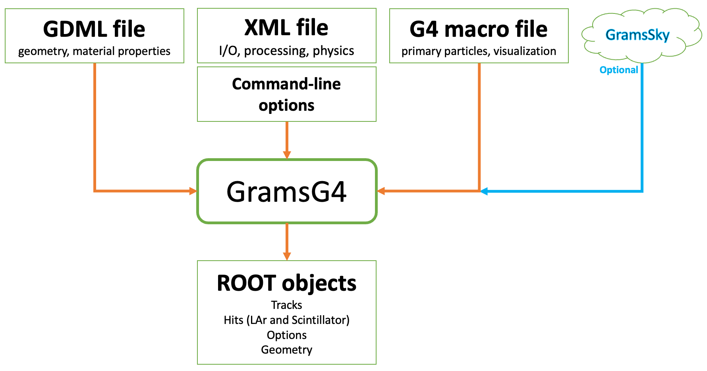

# GramsG4
*Author: [William Seligman](https://github.com/wgseligman)*

_If you want a formatted (or easier-to-read) version of this file, scroll to the bottom of [`GramsSim/README.md`](../README.md) for instructions. If you're reading this on github, then it's already formatted._

- [GramsG4](#gramsg4)
  * [Introduction](#introduction)
  * [Running GramsG4](#running-gramsg4)
  * [Controlling GramsG4](#controlling-gramsg4)
    + [Geometry](#geometry)
    + [Processing options](#processing-options)
    + [G4 macro file](#g4-macro-file)
    + [Option priority](#option-priority)
  * [Controlling the particle source](#controlling-the-particle-source)
  * [Visualization](#visualization)
  * [Events from an external generator](#events-from-an-external-generator)
      - [Notes](#notes)
  * [Program outputs](#program-outputs)
    + [grams::EventID](#grams--eventid)
    + [grams::MCTrackList](#grams--mctracklist)
    + [grams::MCLArHits](#grams--mclarhits)
    + [grams::MCScintHits](#grams--mcscinthits)
  * [Generating large numbers of events](#generating-large-numbers-of-events)
  * [Physics lists and how to extend them](#physics-lists-and-how-to-extend-them)
    + [Using the available physics lists](#using-the-available-physics-lists)
    + [Custom physics lists](#custom-physics-lists)
  * [References](#references)

<small><i><a href='http://ecotrust-canada.github.io/markdown-toc/'>Table of contents generated with markdown-toc</a></i></small>

## Introduction

**GramsG4** is a simulation of particle transport in the [GRAMS][1] detector. It is based on [Geant4][2], a general-purpose particle-physics detector simulation.

[1]: https://express.northeastern.edu/grams/
[2]: http://geant4.web.cern.ch/

- If the Geant4 libraries are not found during the [build process](../DEPENDENCIES.md), then this package will not be compiled.

## Running GramsG4

Before running GramsG4 (or any of the GramsSim programs), please read
[`GramsSim/README.md`](../README.md) for how to set up a GramsSim build/work
area. When you want to change program options, see
[`GramsSim/util/README.md`](../util/README.md).

To run the simulation:

    # After succesfully making the executable "gramsg4", you can run it
    # in the build directory:
    ./gramsg4

If no one has changed the [defaults](../options.xml), the Geant4 simulation
will generate 1000 1 *MeV* gammas. If you'd like to see an interactive
display:

    ./gramsg4 --ui
    
## Controlling GramsG4

As an application, `GramsG4` is a fairly generic Geant4 program. Most of its processing and functionality is controlled by input files. 

|                                         |
| :-------------------------------------: | 
|  |

### Geometry

As noted in the [GramsSim documentation](../README.md), the detector geometry is defined
by a file written in the detector-geometry language [GDML][57]. 

The default name of the GDML file (as given in [`options.xml`](../options.xml)) is `grams.gdml`. This can be overridden by the `-g` (or `--gdmlfile`) option on the command line:

    ./gramsg4 -g alt-geom.gdml
    
### Processing options

As described in the [utilities documentation](../util/README.md), `GramsG4`'s processing can be controlled by the contents of [`options.xml`](../options.xml). In turn, those options can be overridden on the command line. 

### G4 macro file

As with many Geant4 applications, `GramsG4` reads in a Geant4 macro file. This file contains [Geant4 interactive commands][60]. There are many examples in the [`GramsSim/mac`](../mac) directory. 

The default name of the macro file is defined in [`options.xml`](../options.xml). As of 27-Oct-2022, the default value of the `-m` (`--macrofile`) option is `mac/batch.mac`; when running `GramsG4` visualization interface (the `--ui` option), the default value of the `--uimacrofile` option is `mac/vis-menus.mac`. 

There is is one key G4 command that must be in any macro file:

    /run/initialize
    
In general, commands that affect the physics and geometry of the application must come _before_ that line; commands that affect particle and visualization must come _after_ that line. 

### Option priority

In general, the properties and operations of `GramsG4` as controlled by the above files are processed in the following order:

   - GDML file
   - options XML file
   - command-line options
   - G4 macro commands
   
As an example, consider the parameter that controls the size of the steps of charged particles in the liquid argon; this defines the maximum length of the "hits" in the LAr TPC. 

- This is defined in the GDML file: 

        <volume name="volTPCActive"> ...
        <auxiliary auxtype="StepLimit" auxvalue="0.02"/> </volume>

- Can be overridden by an option in the XML file:

        <option name="larstepsize" value="0.01" type="double" />

- Which means it could be overridden on the command line: 

        ./gramsg4 --larstepsize=0.015
        
A second example: Controlling the number execution threads when running `GramsG4` as a multi-threaded application.

- In the `options.xml` file:

        <option name="nthreads" short = "t" value="0" type="integer" desc="number of threads"/>  

- Would be overridden by an option on the command line:

        ./gramsg4 -t 10
    
- But the final say would come from the following if it were specified in the G4 macro file, before `/run/intitialize`:

         /run/numberOfThreads 4

## Controlling the particle source

GramsG4 uses the [Geant4 general particle source][3] (or "gps") to generate primary particles. The gps commands
can only be executed from Geant4 macro files. You can find examples in the [`GramsSim/mac`](../mac) directory. 
See [`GramsSim/mac/README.md`](../mac/README.md) for a description of the examples. 

[3]: http://geant4-userdoc.web.cern.ch/geant4-userdoc/UsersGuides/ForApplicationDeveloper/html/GettingStarted/generalParticleSource.html

To use a particular Geant4 macro file, e.g.,  `mac/run.mac`:
```
    ./gramsg4 -m mac/run.mac    
```

The interactive display uses a different option to specify its macro file, to make it easy to
switch between batch-style tests and interactive displays. For example, to use the interactive
display defined in mac/vis.mac:
```
    ./gramsg4 --ui --uimacrofile mac/vis.mac
``` 

If you want to change the primary particle type, energy, distribution, or number of events generated by the simulation, edit a 
G4 macro file. For example, if you want to generate 2000 events, you can copy an existing
file and edit it:
```
    cp mac/batch.mac my_test.mac
    emacs my_test.mac
    # edit '/run/beamOn 1000' to '/run/beamOn 2000'
    ./gramsg4 --macrofile my_test.mac
```

Of particular interest is the file [`mac/sky.mac`](../mac/sky.mac), which shows how to generate an energy spectrum from a user-supplied histogram with positions given uniformly by a sphere surrounding the detector. 

For more on the gps commands, see the [References](#references) section near the end of this document. 

## Visualization

See [`GramsSim/mac/README.md`](../mac/README.md) for a description of the visualization examples in the [`GramsSim/mac`](../mac) directory.

## Events from an external generator

The GPS commands may not be sufficient. For example, you may want to generate the primary particles from an initial nuclear interaction (*n-n&#773;*
oscillations are one such case), a shower of particles from a cosmic-ray simulation, or the output of GramsSky
(see [`GramsSim/GramsSky/README.md`](../GramsSky/README.md)). 

GramsG4 can read files of events in [HepMC3][10] format. A typical command to run the simulation with an input file would be:

    ./gramsg4 --macrofile mac/hepmc3.mac --inputgen scripts/example.hepmc3

Note that HepMC3 can also read files in various formats. The format of the file is assumed to match the file's extension (the part after the final period ".") as follows:

|  Extension  |  Format                        |
| ----------- | -----------------------------  |
|  .hepmc3    |  HepMC3 ASCII                  |
|  .hepmc2    |  HepMC2 ASCII                  |
|  .hpe       |  [HEPEVT][15] (ASCII)          |
|  .lhef      |  [Les Houches Event File][16]  |
|  .root      |  HepMC3 ROOT                   |
|  .treeroot  |  HepMC3 ROOT TTree             |

[10]: https://gitlab.cern.ch/hepmc/HepMC3
[15]: https://cdcvs.fnal.gov/redmine/projects/minos-sim/wiki/HEPEVT_files
[16]: http://home.thep.lu.se/~leif/LHEF/LHEF_8h_source.html

If you want to write HepMC3 files, there are a couple of simple examples in the [`GramsSim/scripts/`](../scripts) directory. More detailed examples can be found in the `examples/` directory within the HepMC3 distribution. 

#### Notes

   - The number of events generated by GramsG4 is determined by the `/run/beamOn` command in the input `.mac` file; there's an example in [`mac/hepmc3.mac`](../mac/hepmc3.mac). If the number of events in the `beamOn` command exceeds the number of events in the HepMC3 file, GramsG4 will "rewind" the file and read it from the beginning. 
   
   - When creating the event->vertex->particles structure for an HepMC3 `GenEvent` object, there must be at least one incoming particle to the vertex even though GramsG4 will only process the outgoing particles. The program [`GramsSim/script/hepmc3-grams-example.cc`](../script/hepmc3-grams-example.cc) demonstrates a work-around. 
   
   - Of the above formats, `.hepmc3` files are closest to human-readable.


## Program outputs

These are likely to change rapidly as the software improves. This is the state of program outputs as of 21-Jun-2024.

The `gramsg4` program produces only one ROOT output file containing multiple ROOT objects. The default name of the output file is `gramsg4.root`. This can be changed via a job option (see *Program Options* below); e.g.,

    ./gramsg4 -o myStudy.root

will write the output to `myStudy.root`.

Two of those ROOT objects are for keeping track of the options and geometry used to simulate the events; see [the util package](../util) for more information:

   - `Options`, which includes the parsed options for the job (options XML file with the user overrides).
   - The [TGeoManager][2020] description of the detector geometry. The name of this structure comes from the `geometry` parameter in [`options.xml`](../options.xml). 
   
[2020]: https://root.cern.ch/doc/master/classTGeoManager.html 

The remaining object is a ROOT TTree with the following branches (columns); each entry (row) in the tree corresponds to a single simulated event.

   - `EventID`: This contains `gramms::EventID` objects.
   - `TrackList`: The `grams::MCTrackList` object which contains 'MC truth' information for all the simulated tracks in the event.
   - `LArHits`: The `grams::MCLArHits` objects, which contain energy deposits in the LAr (both ionization energy and optical photons) for the event.
   - `ScintHits`: The `grams::MCScintHits` objects, which contain energy deposits in the inner and outer scintillators for the event.
   
These objects are all created in the routine [`GramsSim/GramsG4/src/GramsG4WriteNtuplesAction.cc`](src/GramsG4WriteNtuplesAction.cc). If you have any questions about the details of how the values in these objects are calculated, that routine is the place to start. The structure of the data objects themselves are defined in [GramsDataObj](../GramsDataObj/). 

If you're looking for a place to start in accessing the trees for analysis, look at the examples in the [`scripts`](../scripts) directory which was copied to your build/work directory. 

As you look through the description of the data objects below, consult the [GramsDataObj/include](../GramsDataObj/include) directory for the header files. These are the files that define the methods for accessing the values stored in these objects. Documentation may be inaccurate; the code is actual definition. If it helps, a [std::map][130] is a container whose elements are stored in (key,value) pairs.
If you're familiar with Python, they're similar to [dicts][140]. 

[130]: https://cplusplus.com/reference/map/map/
[140]: https://www.w3schools.com/python/python_dictionaries.asp

### grams::EventID

|  |
| :---------------------------------------------------------: | 
| <small><strong>Sketch of the grams::EventID data object.</strong></small> |

As noted in the [GramsDataObj documentation](../GramsDataObj), `grams::EventID` is an abstraction around the specific values of "run" and "event" number. If the way we identify events were to ever change (for example, a balloon or satellite experiment might not have individual "runs") only a few lines of code would have to change. 


### grams::MCTrackList

|  |
| :-----------------------------------------------------------------: | 
| <small><strong>Sketch of the grams::MCTrackList data object.</strong></small> |

Geant4 transports particles through the detector geometry in the form of [tracks][3000]. A "track" represents a particle's trajectory in both position- and momentum-coordinates, its particle type (a [PDG code][3010]), which detector volume it's in, and so on. 

[3000]: https://geant4-userdoc.web.cern.ch/UsersGuides/IntroductionToGeant4/html/IntroductionToG4.html#overview-of-geant4-functionality
[3010]: https://pdg.lbl.gov/2007/reviews/montecarlorpp.pdf

The [grams::MCTrackList](../GramsDataObj/include/MCTrackList.h) data object contains the "MC Truth" information for those particle tracks, accumulated as each particle is created, travels, and ends (by escaping, by decaying, by interacting, etc.). MCTrackList is a [map][3050] containing `grams::MCTrack` objects. In turn, the MCTrack object contains a `grams::MCTrajectory` object which contains a [vector][3060] of `grams::MCTrajectoryPoint`.

[3050]: https://cplusplus.com/reference/map/map/
[3060]: https://cplusplus.com/reference/vector/vector/

The result is that the complete chain of particle generation as modeled by Geant4 is available through `grams::MCTrackList`.

The value of "TrackID" is a number assigned by Geant4 to each particle track modeled in the simulation. The value of TrackID should be treated as an arbitrary number. While is generally true that higher values of TrackID are assigned to particles that occur later in a sequence of simulated particles (e.g., a parent's TrackID will always be lower than a daughter's), there is no time-ordering associated with the TrackID number. In particular, it is _not_ safe to assume that a primary particle will always have a TrackID of 0. 

### grams::MCLArHits


|  |
| :--------------------------------------------------------------: | 
| <small><strong>Sketch of the grams::MCLArHits data object.</strong></small> |

Certain detector volumes are designated as [sensitive][3100]; that is, they respond in some way to energy deposited within them. For example, in a LArTPC, the liquid argon is sensitive, while the uninstrumented metal walls of a cryostat are not. Energy deposits in a sensitive volume are called [hits][3110]. To put it another way, hits are what the detector is designed to detect. 

[3100]: https://geant4-userdoc.web.cern.ch/UsersGuides/ForApplicationDeveloper/html/Detector/hit.html#sensitive-detector

[3110]: https://geant4-userdoc.web.cern.ch/UsersGuides/ForApplicationDeveloper/html/Detector/hit.html

For a LArTPC, the key purpose of the simulation is to record the energy deposits in the liquid argon (LAr). These are primarily caused by ionization of the argon atoms due to charged particles. 

The [grams::MCLArHits](../GramsDataObj/include/MCLArHits.h) data object is a record of the energy deposits in the LAr. Like `MCTrackList` described above, this is "MC Truth" information in that it contains the calculated amount of hit energy. Subsequent jobs in the analysis chain will adjust this data to better match the signals that will be reported by the detector electronics. 

MCLArHits is a [map][3050] containing `grams::MCLArHit` objects. These contain both the ionization energy from individual steps within the LAr, and the number of photons generated as part of the ionization process. 

The value of "HitID" is completely arbitrary. It's assigned within [`GramsSim/GramsG4/src/GramsG4WriteNtuplesAction.cc`](src/GramsG4WriteNtuplesAction.cc) for purposes of "backtracking" through the GramsSim analysis chain. In particular, do not assume any kind of time ordering based on HitID; HitID==0 does not imply that the hit is the first or earliest energy deposit in the simulated event. 

Also note that there is not a one-to-one mapping between a TrackID being present in MCTrackList and a TrackID/HitID combination being present in in MCLArHits. It is certainly possible for a track not to leave any energy deposits in the LAr; e.g., if the particle "bounces off" the cryostat and never passes through the LAr, and so MCLArHits for that event will be empty. Less frequently, it's possible for a track to be excluded from MCTrackList (due to cuts intended to reduce the number of low-energy particles being saved by GramsG4) yet still deposit energy in the LAr and therefore recorded in MCLArHits.

Geant4 tracks particles in units of [steps][3120]. In order to provide a more accurate geometric model of particle energy loss along a track, `GramsG4` has a parameter to control the maximum step size of a charged particle in the LAr. This is parameter `larstepsize` in the [options XML](../options.xml) file. 

[3120]: https://geant4-userdoc.web.cern.ch/UsersGuides/ForApplicationDeveloper/html/TrackingAndPhysics/tracking.html

The following image shows an extremely zoomed-in view of one simulated Compton scatter within the LAr, as shown in the Geant4 event display. The "straggling" red line is the Compton electron; the straight green lines are the photon's trajectory. Each line segment along the electron track is an individual step, and therefore would be recorded as an MCLArHit. The maximum length of any one of those electron-track line segments is `larstepsize`, which was set to 0.2mm for this particular run of GramsG4.

|  |
| :-------------------------------------: | 
| <small><strong>A zoomed-in view of a Compton scatter in Geant4.</strong></small> |

Even though the value of the step size was set to a maximum of 0.2mm, the actual size of the electron-track line segments in this image is shorter than that, on the order of 0.01mm. The overall size of the scatter in the image is about 0.5mm. This image was selected as a "dramatic" scatter (longer than typical); most scatters are shorter and have fewer hits than this. 

### grams::MCScintHits


|  |
| :--------------------------------------------------------------: | 
| <small><strong>Sketch of the grams::MCScintHits data object.</strong></small> |

The [grams::MCScintHits](../GramsDataObj/include/MCScintHits.h) data object is the equivalent of MCLArHits, but for energy deposits in the scintillator strips that make up the detector's time-of-flight (TOF) or veto-wall subsystems. MCScintHits is a [map][3050] containing `grams::MCScintHit` objects. 

Since energy deposits in a LArTPC's scintillator subsystems are used for timing and veto of the events in the LAr, but typically not for the physics of the event. Therefore the `MCScintHit` information is not recorded to the same level of detail as an `MCLArHit`.


## Generating large numbers of events

Some things to consider:

   - You can speed up the simulation considerably by turning on multi-threaded running. To do this, supply the number of threads to use via the `-t` or `--nthreads` option; e.g.,
   
         ./gramsg4 --nthreads 4
      
     will run with 4 simultaneous threads. The potential disadvantage of this is that the information in the output ntuples will *not* be in ascending order; while all the rows associated with a particular event will be adjacent to each other, the events will be written in a random order to the output ntuple. 
       
   - If you are running multiple jobs to generate events, by default they'll all run with the same random number seed;i.e., in the options XML file there is a parameter `rngseed` which is set to -1 by default. To generate a different set
   of events for each job, you will want to vary the seed for each job. 
   
      For example, if the job has a unique process ID in the variable `${Process}`, then you probably want something like this:
      
         ./gramsg4 --rngseed ${Process}

   - You can save and restore random-number sequences; this can be
     used to re-create the random numbers associated with a particular
     event. The list of relevant parameters in [`options.xml`](../options.xml) is: 
     
     - `rngdir`: The state of the random-number generator (RNG) must be saved and restored from a named directory. If this parameter is `""`, saving and restoring the RNG state is disabled. If you want to save the random-number state in the current directory, set this to `"."`.
     
     - `rngperevent`: This is a Geant4 run-manager code that specifies how often the RNG state is saved. For an up-to-date list, see `$G4INSTALL/include/Geant4/G4RunManager.hh`. As of Oct-2022, the allowed values are:
     
            value="0" - Save only the per-run RNG state in 'rngdir'.
            value="1" - Save the RNG state before primary-particle generation.
            value="2" - Save the RNG state before event processing (after primary generation)
            value="3" - Both are stored.
            
     - `rngrestorefile`: This is the name of the file within `rngdir` that will be used to restore the RNG at the start of the simulation. 
     
     If you are running `gramsg4` as a multi-threaded application (see the `nthreads` option), then each individual thread will write its own RNG state. The RNG state files are always preceded with `G4WorkerN_`, where N is the G4-assigned thread number. Keep this in mind as you examine the per-event RNG state files. For example, event 500's state may be in `G4Worker4_run0evt500.rndm` while event 501's state may be in `G4Worker2_run0evt501.rndm`; the two files will not be next to each other in a standard directory listing (`ls`). 

## Physics lists and how to extend them

If you looked at [`options.xml`](../options.xml) you saw an intriguing option (the list may not be `FTFP_BERT`):


    <option name="physicslist" short= "p" value="FTFP_BERT" type="string" desc="physics list"/>

The program uses the extensible physics-list factory described in a
Geant4 example; at Nevis, this example can be found at
`$G4INSTALL/share/*/examples/extended/physicslists/extensibleFactory`.
If you run the program using the "&#x2011;&#x2011;showphysicslists" option (or simply
"&#x2011;l" [that's "dash&#x2011;ell", not "dash&#x2011;one"]), you'll see all the available physics
lists and modifiers. 

Here's the first part of the output when I run this command with Geant4 10.5.1:
```
./gramsg4 -l
    
Available physics lists:
Base G4VModularPhysicsLists in G4PhysListRegistry are:
 [  0]  "FTFP_BERT"
 [  1]  "FTFP_BERT_ATL"
 [  2]  "FTFP_BERT_HP"
 [  3]  "FTFP_BERT_TRV"
 [  4]  "FTFP_INCLXX"
 [  5]  "FTFP_INCLXX_HP"
 [  6]  "FTFQGSP_BERT"
 [  7]  "FTF_BIC"
 [  8]  "G4GenericPhysicsList"
 [  9]  "LBE"
 [ 10]  "MySpecialPhysList"
```

and so on.

### Using the available physics lists

If you've gotten this far, you're probably overwhelmed with the choices.
Your first question is probably "What does each of them do?"
Unfortunately, at the time of this writing (May-2020) there isn't one
single source that provides an answer. Here are some links to get you
started:

   * [Short Guide to Choosing Your Physics List][50] (PDF presentation)
   * [G4 Physics List Guide][51] (incomplete)

[50]: https://indico.cern.ch/event/776050/contributions/3241826/attachments/1789270/2914266/ChoosingPhysLists.pdf
[51]: http://geant4-userdoc.web.cern.ch/geant4-userdoc/UsersGuides/PhysicsListGuide/BackupVersions/V10.5-2.0/html/physicslistguide.html

If you're just starting out, the Geant4 collaboration's recommendations for initial tests is `FTFP_BERT`. 
Here it is set explicitly on the command line:


    ./gramsg4 --physicslist FTFP_BERT

If your research indicates you should try one of the other base physics lists, e.g., `QBBC`


    ./gramsg4 --physicslist QBBC

Perhaps you decide that you want to try one of the alternative models for EM physics, listed under *Replacement mappings* in the full output of &#x2011;&#x2011;showphysicslists:

    ./gramsg4 --physicslist QBBC_EMV

If you need to include one or more of the additional constructors, e.g., `G4OpticalPhysics`:

    ./gramsg4 --physicslist QBBC_EMV+G4OpticalPhysics

### Custom physics lists

If you look at the above list carefully, you saw `MySpecialPhysList`
among the available lists. This comes from the Geant4 extensibleFactory
example, and can serve as a basis for your own fine-tuning of a physics
list. To understand what you need to do to add your own custom list, see
these files:

```
GramsSim/GramsG4/gramsg4.cc
GramsSim/GramsG4/include/MySpecialPhysList.hh
GramsSim/GramsG4/include/MySpecialPhysList.icc
```

These last two files are unaltered from the Geant4 extensibleFactory
example. As it stands, they just implement the QBBC physics list without
any changes.

To get some idea of what and how you can change in your own custom
physics list, see the Geant4 examples. To find relevant files, at Nevis
I use the UNIX `find` command:

    find $G4INSTALL/share/*/examples/ -name \*PhysicsList\*

This will show you many places to get started!

## References

Toolkits:

   - [Geant4 Manual][55]
   - [ROOT Tutorial][56]

[55]: http://geant4.web.cern.ch/geant4/UserDocumentation/UsersGuides/ForApplicationDeveloper/html/
[56]: https://www.nevis.columbia.edu/~seligman/root-class/

GDML detector geometry description

   - [GDML manual][57]
   - [Geant4 Applications Guide][60], especially the [geometry section][61] which explains the difference between solids, logical volumes, and physical volumes. 

[57]: http://lcgapp.cern.ch/project/simu/framework/GDML/doc/GDMLmanual.pdf
[60]: http://geant4-userdoc.web.cern.ch/geant4-userdoc/UsersGuides/ForApplicationDeveloper/html/
[61]: http://geant4-userdoc.web.cern.ch/geant4-userdoc/UsersGuides/ForApplicationDeveloper/html/Detector/Geometry/geometry.html

Geant4 General Particle Source:

   - [Documentation][62]
   - [Examples][63]
   - [Concepts][64] (Microsoft Powerpoint document)

[62]: http://geant4-userdoc.web.cern.ch/geant4-userdoc/UsersGuides/ForApplicationDeveloper/html/GettingStarted/generalParticleSource.html
[63]: http://hurel.hanyang.ac.kr/Geant4/Geant4_GPS/reat.space.qinetiq.com/gps/examples/examples.html
[64]: https://www.google.com/url?sa=t&rct=j&q=&esrc=s&source=web&cd=&cad=rja&uact=8&ved=2ahUKEwiY15u9wP3qAhXFJt8KHQk7C1gQFjADegQIBRAB&url=https%3A%2F%2Findico.in2p3.fr%2Fevent%2F443%2Fcontributions%2F30793%2Fattachments%2F24858%2F30632%2FGSantin_Geant4_Annecy2008_GPS_v11.ppt&usg=AOvVaw0yJS5FTzA2-btA1ag7XCX9 