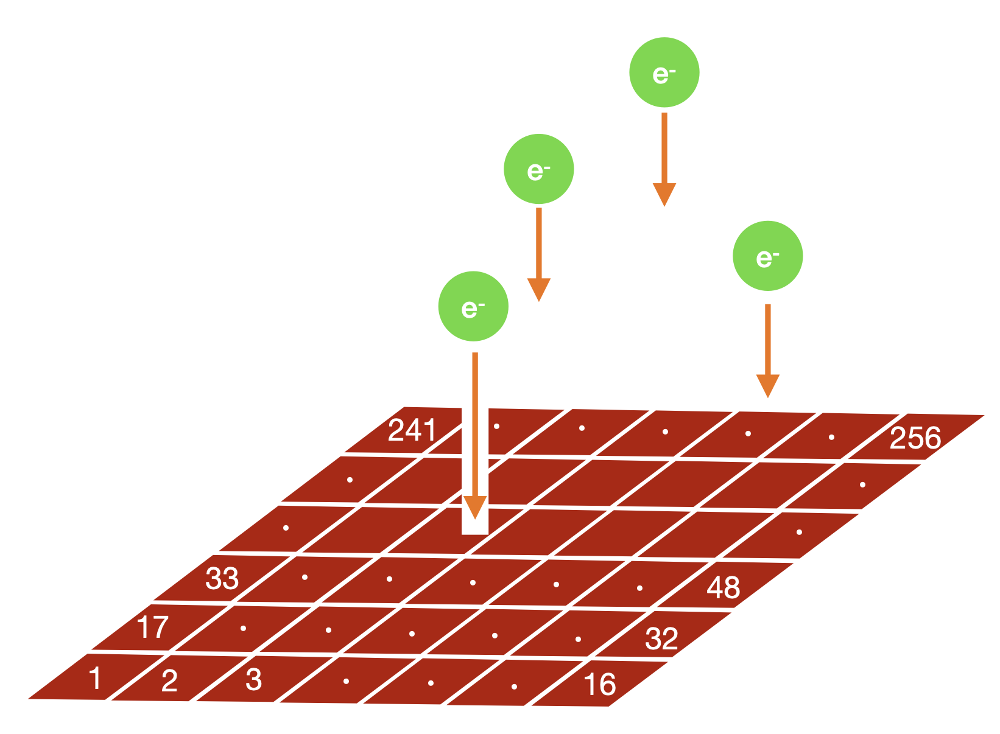

# GramsReadoutSim
*Author: Satoshi Takashima*

The purpose of this program is to model the readout geometry of the GRAMS detector. 

As of Nov-2022, it's anticipated that the readout of the GRAMS LArTPC will be a pixel detector. However, other LArTPC detectors have used wires, and in the future yet another charge readout technologies may be developed. Hence the readout system is modeled in a program of its own. 

In [`GramsDetSim`](../GramsDetSim), the ionization left by charged-particle tracks was divided into electron clusters and drifted to the anode of the LArTPC. `GramsReadoutSim` assigns a pixel ID to each cluster, with the pixel ID defined as an integer pair in (x,y).

|  |
| :---------------------------------------------: | 
| <small><strong>Sketch by Satoshi Takashima of the operation of `GramsReadoutSim`. Note that after he created this diagram, he choose a different scheme for assigning a pixel ID. The pixel ID is assigned as pair of integers (x,y) instead of an consecutive integer over a grid. </strong></small> |

Since the pixel readout is presently modeled as a simple 2D grid in x and y, the `GramsReadoutSim` parameters are equally simple:

- `pixel_sizex` and `pixel_sizey`: The x- and y-sizes of the individual pixel regions. 

- `readout_centerx` and `readout_centery`: The x- and y-offset of the center of the readout geometry from the (x=0,y=0) coordinate of the detector geometry. 

The output ntuple include the pixel ID assigned to each individual charge cluster in the input. 

