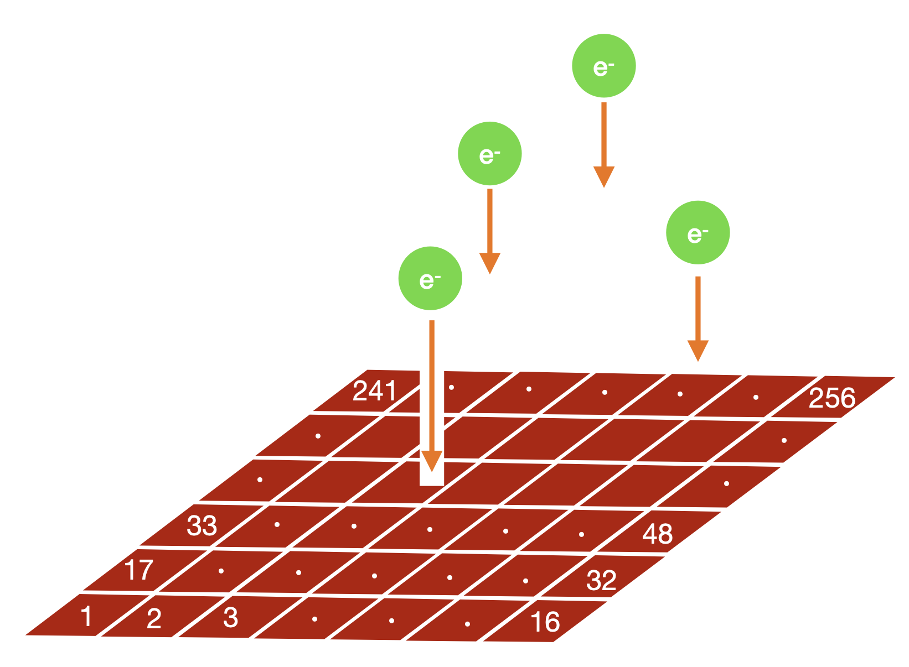
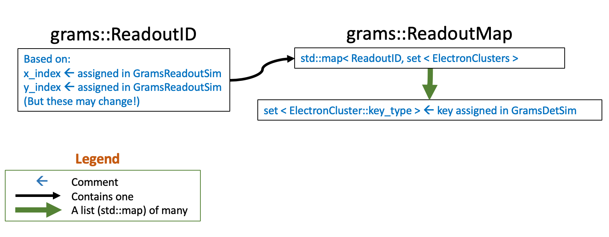

# GramsReadoutSim
*Author: Satoshi Takashima*

_If you want a formatted (or easier-to-read) version of this file, scroll to the bottom of [`GramsSim/README.md`](../README.md) for instructions. If you're reading this on github, then it's already formatted._

- [GramsReadoutSim](#gramsreadoutsim)
  * [grams::ReadoutMap](#grams--readoutmap)
  * [Design note](#design-note)

<small><i><a href='http://ecotrust-canada.github.io/markdown-toc/'>Table of contents generated with markdown-toc</a></i></small>

The purpose of this program is to model the readout geometry of the GRAMS detector. 

As of Nov-2022, it's anticipated that the readout of the GRAMS LArTPC will be a pixel detector. However, other LArTPC detectors have used wires, and in the future yet another charge readout technologies may be developed. Hence the readout system is modeled in a program of its own. 

In [`GramsDetSim`](../GramsDetSim), the ionization left by charged-particle tracks was divided into electron clusters and drifted to the anode of the LArTPC. `GramsReadoutSim` assigns a pixel ID to each cluster, with the pixel ID defined as an integer pair in (x,y).

|  |
| :---------------------------------------------: | 
| <small><strong>Sketch by Satoshi Takashima of the operation of `GramsReadoutSim`. Note that after he created this diagram, he choose a different scheme for assigning a pixel ID. The pixel ID is assigned as pair of integers (x,y) instead of an consecutive integer over a grid. </strong></small> |

See [`GramsSim/util/README.md`](../util/README.md) for a description of how to control the
operation of `gramsreadoutsim` through the [`options.xml`](../options.xml) file and the
command line.

Since the readout is presently modeled as a simple 2D grid in x and y, the `GramsReadoutSim` parameters are equally simple:

- `gdml` : The ROOT-compatible gdml file emitted by GramsG4

- `anodeTileVolume`: The volume in gdml file that corresponds to Anode Tile plane. You extract the dimensions of the pixel grid from this

- `x_resolution` and `y_resolution`: Number of pixels along the x/y direction(s)

- `readout_centerx` and `readout_centery`: The x- and y-offset of the center of the readout geometry from the (x=0,y=0) coordinate of the detector geometry. 

## grams::ReadoutMap

As you look through the description below, consult the [GramsDataObj/include](../GramsDataObj/include) directory for the header files. These are the files that define the methods for accessing the values stored in this object. Documentation may be inaccurate; the code is actual definition. If it helps, a [std::map][130] is a container whose elements are stored in (key,value) pairs. If you're familiar with Python, they're similar to [dicts][140]. 

[130]: https://cplusplus.com/reference/map/map/
[140]: https://www.w3schools.com/python/python_dictionaries.asp

|  |
| :------------------------------------------------------------: | 
| <small><strong>Sketch of the grams::ReadoutMap data object.</strong></small> |

The purpose of GramsReadoutSim is to assign the electron clusters derived in [GramsDetSim](../GramsDetSim) to readout channels for an event; the data object [`grams::ReadoutMap`](../GramsDataObj/include/ReadoutMap.h) contains the result. Each readout channel is assigned a `grams::ReadoutID`. The data object `grams::ReadoutMap` is a [map][130] of all the channels that have clusters. Each channel has a [`std::set`][4000] (the equivalent of Python [list][4010]) of electron clusters associated with that channel.

[4000]: https://cplusplus.com/reference/set/set/
[4010]: https://www.w3schools.com/python/python_lists.asp

Rather than storing the complete [`grams::ElectronCluster`](../GramsDataObj/include/ElectronClusters.h) for each cluster, only the key to the `grams::ElectronClusters` map is stored. Therefore, to see the information for the clusters for a given readout channel, you'll typically have to open both of the output files from GramsDetSim and GramsReadoutSim, and use the `grams::ReadoutMap` to look up the information within `grams::ElectronClusters`.

If this is confusing, see the code for [GramsElecSim](../GramsElecSim/gramselecsim.cc). Here's an excerpt from that program (without comments or error detection):

```c++
// Define the two input trees as friends.
auto input = TFile::Open("gramsreadoutsim.root");
auto tree = input->Get<TTree>("ReadoutMap");
tree->AddFriend("ElectronClusters","gramselecsim.root")
auto reader = new TTreeReader(tree);
// 
TTreeReaderValue<grams::ElectronClusters> clusters = {*reader, "ElectronClusters"};
TTreeReaderValue<grams::ReadoutMap> readoutMap     = {*reader, "ReadoutMap"};
// ...
    
// For each row in the input tree:
while ( (*reader).Next() ) {

    // For each readout cell that received any electron clusters:
    for ( const auto& [ readoutID, clusterKeys ] : (*readoutMap) ) {

      // for each electron cluster assigned to this readout cell:
      for ( const auto& clusterKey: clusterKeys ) {

        // Find the key for this cluster in our list of electron clusters. 
        const auto search = clusters->find( clusterKey );

        // We found the cluster's key in the list of electron
        // clusters. Fetch that cluster; remember that a map consists of
        // pairs (first,second).
        const auto& cluster = (*search).second;

        // 'cluster' is a grams::ElectronCluster assigned to this ReadoutID
        // Do whatever with 'cluster'...``
    }
}
```

## Design note

It's reasonable to ask why the functions of GramsDetSim,
GramsReadoutSim, and GramsElecSim are in three separate programs.

Functionally, each of these programs relates to a different aspect of
an experiment's simulation:

   - GramsDetSim relates to the physics of charge transport in the detector.

   - GramsReadoutSim relates to the geometry of the readout anode.

   - GramsElecSim relates to the design of the data-acquisition electronics.

Experience has taught us that for the purpose of planning, testing,
studies, and maintenance, it's best to have these functions in
separate programs, rather than one large program.
