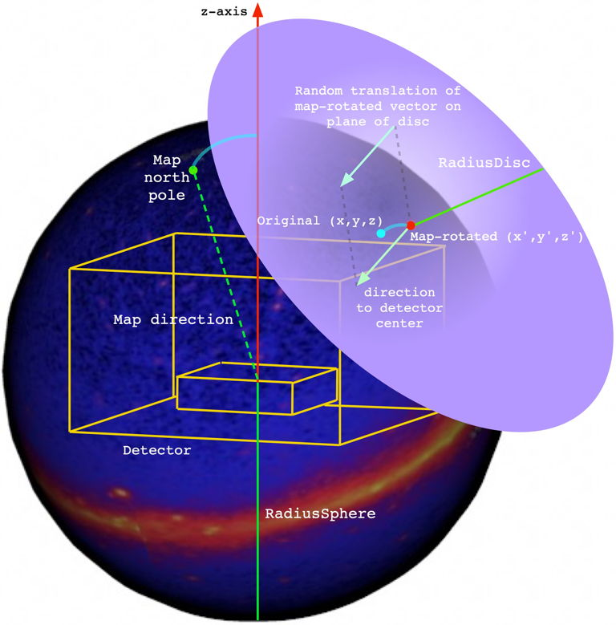
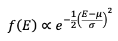
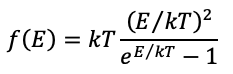
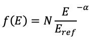
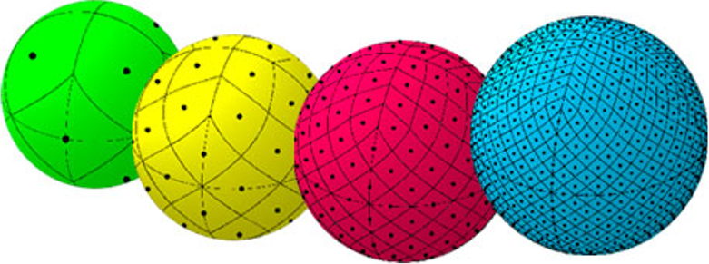

# GramsSky

- [GramsSky](#gramssky)
  * [The process of GramsSky generation](#the-process-of-gramssky-generation)
  * [Position generators](#position-generators)
    + [`"Point"`](#point)
    + [`"Iso"`](#iso)
  * [Energy generators](#energy-generators)
    + [`"Fixed"`](#fixed)
    + [`"Flat"`](#flat)
    + [`"Gaus"`](#gaus)
    + [`"BlackBody"`](#blackbody)
    + [`"PowerLaw"`](#powerlaw)
    + [`"Hist"`](#hist)
  * [Combined position and energy generators](#combined-position-and-energy-generators)
    + [`"MapPowerLaw"`](#mappowerlaw)
    + [`"MapEnergyBands"`](#mapenergybands)

<small><i><a href='http://ecotrust-canada.github.io/markdown-toc/'>Table of contents generated with markdown-toc</a></i></small>

`GramsSky` is a simulation of particles coming from spherical (sky) distributions around a detector. Using the [options XML file](../util/README.md), the user can specify position and energy distributions coming from the inner surface of a "celestial sphere". 

Note: 

- If the HepMC3 libraries are not found during the [build process](../DEPENDENCIES.md), then this package will not be compiled.

- If the [FITSIO][20] and [HEALPix][21] libraries are not found during the build process, then any generators involving HEALPix maps won't be compiled into `GramsSky`. 

In the following documentation, names in __`this format`__ are parameters in the [options XML file](../options.xml). 

## Output

The input and output units for the parameters described in the rest of this documentation are determined by parameters __`LengthUnit`__ and __`EnergyUnit`__. Normally these options are in the `<global>` section of the options XML file. 

The output consists of events in [HepMC3][10] format, which can be used as input to [GramsG4](../GramsG4/README.md). 

`GramsSky` can write files in various formats. The format of the file is assumed to match the file's extension (the part after the final period ".") as follows:

|  Extension  |  Format                        |
| ----------- | -----------------------------  |
|  .hepmc3    |  HepMC3 ASCII                  |
|  .hepmc2    |  HepMC2 ASCII                  |
|  .hpe       |  [HEPEVT][15] (ASCII)          |
|  .lhef      |  [Les Houches Event File][16]  |
|  .root      |  HepMC3 ROOT                   |
|  .treeroot  |  HepMC3 ROOT TTree             |

[10]: https://gitlab.cern.ch/hepmc/HepMC3
[15]: https://cdcvs.fnal.gov/redmine/projects/minos-sim/wiki/HEPEVT_files
[16]: http://home.thep.lu.se/~leif/LHEF/LHEF_8h_source.html

If you want to preserve the program options in the output of `gramssky` as discussed in the [`Options` documentation](../util/README.md), you must use the `.treeroot` format. The program can't save a separate `Options` ntuple in any other format.

## The process of GramsSky generation

The general operation of `GramsSky` is similar to the [General Particle Source][62] available in [Geant4][60]. The principle difference is in the random "translation" of the generated particle to simulate that it was generated at "infinity" (or at least several light-years away). Understanding that process is crucial to supplying meaningful [options](../util/README.md) to the program, so it will be addressed first.

[60]: https://geant4.web.cern.ch/
[62]: http://geant4-userdoc.web.cern.ch/geant4-userdoc/UsersGuides/ForApplicationDeveloper/html/GettingStarted/generalParticleSource.html

|                                          |
| :--------------------------------------: | 
|  |

The number of events to generate comes from the __`events`__ parameter in the options file. For each such event: 

   - A particle is generated at an original (x,y,z) as determined by the position algorithm selected by the user; see the list of possible algorithms below. Note that the particle's origin is on the surface of a sphere of radius __`RadiusSphere`__ and center __`OriginSphere`__.

      - While nominally __`OriginSphere`__ would be the center of the detector, the definition of the "center" of the GRAMS detector may depend on the type of study being done: As of 11-Jan-2022, the origin of the z-axis is set to be the bottom of the anode plate (to be partially compatible with [LArSoft][15]). In this coordinate system and with the geometry in [`grams.gdml`](../grams.gdml) as of 11-Jan-2022, the center of the LArTPC is (0,0,-14.783); the center of the overall detector is at (0,0,45.217).
   
[15]: https://github.com/LArSoft
   
   - The particle's kinetic energy _E_ is generated according to the energy algorithm selected by the user; again, see below.
   
   - The magnitude of the particle's momentum is calculated by _p = sqrt(E^2 - m^2)_, where _m_ is the particle's mass from ROOT's [TParticlePDG][10] database based on the value of __`PrimaryPDG`__.
   
[10]: https://root.cern.ch/doc/master/classTDatabasePDG.html
[11]: https://pdg.lbl.gov/2007/reviews/montecarlorpp.pdf

   - __`MapDirection`__ is the direction of "north pole" of the map with respect to the z-axis of the detector coordinate system. This parameter is necessary because the sky maps are normally oriented with (&theta;,&phi;)=(90&deg;,0) at the galactic north pole, while a detector will have some other orientation with respect to the earth's surface. 
   
      __`MapDirection`__ is used to rotate the original (x,y,z) in the celestial sphere coordinate system to (x',y',z') in the detector coordinate system. 
    
   - The momentum direction is taken to be of magnitude _p_ and in the direction of the center of celestial sphere at __`OriginSphere`__. Call this (px,py,pz).
   
   - The direction of (x',y',z') is assumed to be located at a very large distance from the detector. Therefore, all particles from that source appear to be coming from that direction independent of the location within the detector; in other words, the celestial sphere always appears to be at infinity no matter from where you look. To simulate this effect, the source of the particles is taken to be a disc with radius __`RadiusDisc`__ that is tangent to the celestial sphere at (x',y',z').
   
      - In the XML file, if __`RadiusDisc`__ less than or equal to zero, the program will use the value of __`RadiusSphere`__. Note that, given the [grams.gdml](../grams.gdml) file as of 11-Jan-2022, a radius of 267 _cm_ is sufficient to cover the entire GRAMS outer detector; a radius of 108 _cm_ will cover the LArTPC. (These values come from adding the dimensions of the relevant volume in quadrature to get the maximum length of the volume's diagonal.) Check that the value of __`OriginSphere`__ is consistent with the __`RadiusDisc`__ you choose.
      
         However, if __`RadiusDisc`__ is larger than those limits, it won't directly affect the simulation. It just means that you're generating more particles whose trajectory won't interact with the detector.

   - The vector with origin (x',y',z') and vector (px,py,pz) is translated along the plane of the disc to a random (r,&theta;) in the _disc's_ coordinate system. These translated values are what's written as the particle's information in the `gramssky` output. 
     
      - Note that `gramssky` does _not_ check to make sure that the translated vertex is within the world volume defined by the [GDML](../grams.gdml) file. If a particle's vertex is outside the world volume, [`gramsg4`](../GramsG4) will not crash, but it will skip over the particle with a warning message. It's a good idea to verify that the celestial sphere and any potential tangent discs do not lie wholly or partially outside the world volume. One possible fix is to increase the size of the world volume in [the GDML file](../grams.gdml), at a cost of a modest increase in the execution time of `gramsg4` as it propagates particles through a larger world.
      
   - If you are running multiple jobs to generate events, by default they'll all run with the same random number seed;
   i.e., in the options XML file there is a parameter `rngseed` which is set to -1 by default. To generate a different set
   of events for each job, you will want to vary the seed for each job. 
   
      For example, if the job has a unique process ID in the variable `${Process}`, then you probably want something like this:
      
      `./gramssky --rngseed ${Process}`

## Position generators

These are the available generators for (x,y,z) as 11-Jan-2022. If option __`PositionGeneration`__ has the value: 

### `"Point"`

The user must supply the option __`PointSource`__ with a vector of values (x,y,z). All the particles are generated with an initial vertex at that point, then undergo the geometric transformations described above. 

   - The position (x,y,z) will be translated to the surface of the celestial sphere automatically. There's no need to do elaborate calculations to make sure (x,y,z) is exactly __`RadiusSphere`__ from __`OriginSphere`__; the program takes care of that. 

### `"Iso"`

The particle position is generated isotropically on the inner surface of the celestial sphere. The controlling options are:

   - __`ThetaMinMax`__: the value is a two-element vector with minimum and maximum &theta;.
   - __`PhiMinMax`__: the value is a two-element vector with minimum and maximum &phi;.

Units are radians. Setting __`ThetaMinMax`__ to `(0,1.571)` and __`PhiMinMax`__ to `(0,6.283)` will generate particle isotropically in a hemisphere above the detector (subject to the geometry transforms described above).

## Energy generators

These are the available generators for _E_ as 11-Jan-2022. If option __`EnergyGeneration`__ has the value: 

### `"Fixed"`

The value of _E_ comes from the option `FixedEnergy`.

### `"Flat"`

_E_ is generated uniformly between the values of parameters __`EnergyMin`__ and __`EnergyMax`__.

### `"Gaus"`

The gaussian distribution is of the form:

where _&mu;_ is the mean of the distribution and _&sigma;_ is the width. _E_ is generated with _&mu;_ given by __`GausMean`__ and _&sigma;_ given by __`GausWidth`__. 

   - Note that the limits in parameters __`EnergyMin`__ and __`EnergyMax`__ still apply to this generator. This is to keep the value of _E_ from going negative, which would cause problems in both `gramssky` and `gramsg4`.
   
### `"BlackBody"`

The black-body radiation function is of the form:

where _kT_ is the "radiation temperature". _E_ is generated according to a black-body distribution with _kT_ given by parameter __`RadTemp`__. 

   - Again, the limits in parameters __`EnergyMin`__ and __`EnergyMax`__ still apply to this generator.
   - The units of _kT_ must be the same as that of __`EnergyMin`__ and __`EnergyMax`__; i.e., the value of the global parameter `EnergyUnit`.
   
### `"PowerLaw"`

The power-law function is of the form:

where

   - _N_ is a normalization
   - _Eref_ is the "reference energy"
   - _&alpha;_ is the "photon index"

_E_ is generated according to a power-law distribution with _&alpha;_ given by parameter __`PhotonIndex`__.

   - The limits in parameters __`EnergyMin`__ and __`EnergyMax`__ still apply to this generator.
   
### `"Hist"`

The program expects two parameters: __`HistFile`__ with the name of a ROOT file, and __`HistName`__ with the name of a histogram within that file. 

   - Both __`HistFile`__ and __`HistName`__ can contain path specifiers for directories either on the computer system or within the ROOT file. 
   
   - For this generator, the values of __`EnergyMin`__ and __`EnergyMax`__ are ignored. Instead, the energy limits effectively come from the bin limits of the histogram. 
   
## Combined position and energy generators

As of Feb-2022, all the generators in this category make use of the [FITSIO][20] and [HEALPix][21] libraries.

[20]: https://heasarc.gsfc.nasa.gov/fitsio/ 
[21]: https://healpix.jpl.nasa.gov/ 

   - FITS is a file format intended for both images and multi-dimensional data.

   - HEALPix is a pixelization for evenly subdividing a sphere. 
   
   |                                       |
   | :-----------------------------------: | 
   |  |
   | Courtesy NASA/JPL-Caltech             |
   
   - Credit to Naomi Tsuji and Hiroki Yoneda, who provided me with the code and files to incorporate the following into GramsSky. 

   - As noted above, if the `healpix_cxx` libraries are not installed on your system, the following generators will not be compiled into GramsSky. 

For the following options, the value of __`EnergyGeneration`__ is ignored. If option __`PositionGeneration`__ has the value: 

### `"MapPowerLaw"`

This method uses three HEALPix maps, one for each parameter in a [power-law](#--powerlaw--) distribution:

   |                                       |
   | :-----------------------------------: | 
   |  |
   
The procedure is to randomly select a pixel, then randomly generate the energy according to the power-law distribution at that position. 

This approach is intended as a simple simulation for stellar sources.

The parameters for `"MapPowerLaw"` are:

   - `"MapPowerLawFile"` = the name of the HEALPix file containing the power-law maps. 
   
   - `"MapPowerLawHDU"` = the [HDU][20] for the HEALPix maps within the file.

[20]: https://heasarc.gsfc.nasa.gov/fitsio/c/c_user/node21.html

   - `"MapPowerLawColumnNorm"` = the "column number" of the map for parameter _N_ within the HDU.
   
   - `"MapPowerLawColumnIndex"` = the "column number" of the map for parameter _&alpha;_ within the HDU.
   
   - `"MapPowerLawColumnEref"` = the "column number" of the map for parameter _Eref_ within the HDU.

   - The limits in parameters __`EnergyMin`__ and __`EnergyMax`__ are applied to the power-law distribution within each pixel.

Note that this HDU/column structure may not be permanent, depending on the evolution of the process as determined by Naomi Tsuji and Hiroki Yoneda.

### `"MapEnergyBands"`

This method uses a series of HEALPix maps, one for each of an increasing set of energies. 

   |                                       |
   | :-----------------------------------: | 
   |  |

The procedure is to randomly select an energy band, then randomly select a pixel from the flux in that band, and finally generate an energy distribution for that particular pixel from a power-law distribution. 

This approach is intended to simulate the diffuse sky background.

The parameters for `"MapEnergyBands"` are:

   - `"MapEnergyBandsFile"` = the name of the HEALPix file containing the energy-band maps. 
   
   - `"MapEnergyBandsHDU"` = the [HDU][20] for the HEALPix maps within the file.
   
   - `"MapNumberEnergyBandsKey"` = within the HDU, this is a key whose value is the number of energy-band maps in the file. 
   
   - `"MapEnergyBandsPrefix"` = The key for each map is formed by this string, suffixed by a number. For example, if `MapNumberEnergyBandsKey` is `"NMAP"` and `MapEnergyBandsPrefix` is `"ENE"`, the individual maps have keys `"ENEnn"` where nn is 1 through `NMAP`.
   
   - Only those energy bands with energies beween __`EnergyMin`__ and __`EnergyMax`__ are used in the above procedure.

Note that this HDU/column structure may not be permanent, depending on the evolution of the process as determined by Naomi Tsuji and Hiroki Yoneda.
