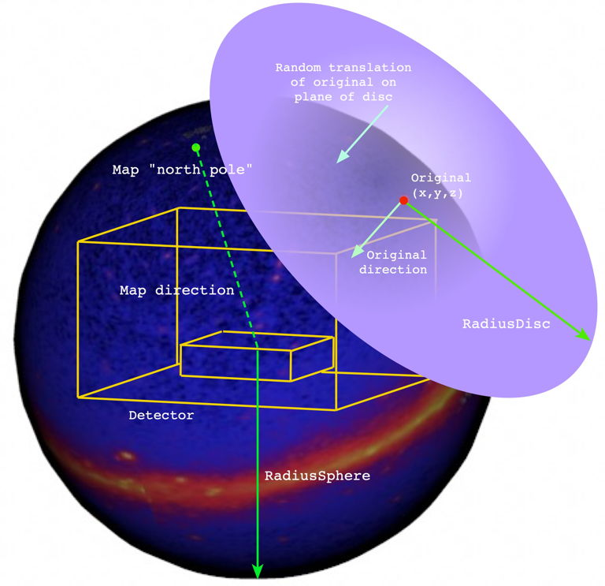

# GramsSky

This program is a simulation of particles coming from spherical (sky) backgrounds around the GRAMS detector. Using the [options XML file](../util/README.md), the user can specify position and energy distributions coming from a "celestial sphere" around the detector. The output consists of events in [HepMC3][10] format, which can be used as input to [GramsG4](../GramsG4/README.md). 

[10]: https://gitlab.cern.ch/hepmc/HepMC3

This is similar to the [General Particle Source][62] available in [Geant4][60]. The principle difference in the random "translation" of the generated particle to simulate that it was generated at "infinity" (or at least several light-years away). Understanding that process is crucial to supply meaningful [options](../options.xml) to the program, so it will be addressed first.

[60]: https://geant4.web.cern.ch/
[62]: http://geant4-userdoc.web.cern.ch/geant4-userdoc/UsersGuides/ForApplicationDeveloper/html/GettingStarted/generalParticleSource.html

## The geometry of GramsSky generation

The program `gramssky` does not depend on a [GDML file](../grams.gdml) to supple a detector description. 

These are the steps taken to generate an event in GramsSky:

   - The particle is generated at an (x,y,z) as determined by the position algorithm selected by the user; see the list of possible algorithms below. 
   
   - The particle's energy _E_ is generated according to the energy algorithm selected by the user; again, see below.
   
   - The magnitude of the particle's momentum is calculated by $p = `sqrt{E^{2} - m^{2}}`$, where _m_ is the particle's mass from ROOT's [TParticlePDG][10] class based on its [PDG code][11]
   
[10]: https://root.cern.ch/doc/master/classTDatabasePDG.html
[11]: https://pdg.lbl.gov/2007/reviews/montecarlorpp.pdf

It might look something like this. 
