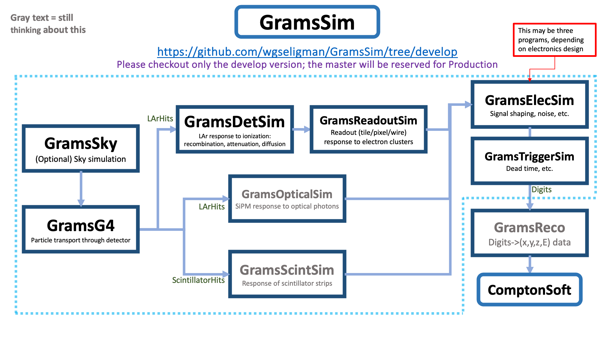

# GramsSim
*Principle Maintainer: [William Seligman](https://github.com/wgseligman)*

_If you want a formatted (or easier-to-read) version of this file, scroll to the bottom of this page for instructions. If you're reading this on github, then it's already formatted._
 
- [GramsSim](#gramssim)
  * [Introduction](#introduction)
  * [Installing GramsSim](#installing-gramssim)
    + [Working with github](#working-with-github)
  * [Setting up GramsSim](#setting-up-gramssim)
  * [Making changes](#making-changes)
    + [Advanced git commands](#advanced-git-commands)
    + [Work files](#work-files)
    + [Development "flow"](#development--flow-)
  * [Detector geometry](#detector-geometry)
  * [Program options](#program-options)
    + [Random numbers](#random-numbers)
    + [Setting run/event numbers](#setting-run-event-numbers)
    + [Documenting the analysis chain](#documenting-the-analysis-chain)
  * [FAQ](#faq)
  * [References](#references)
  * [Credits](#credits)
  * [Viewing a Markdown document](#viewing-a-markdown-document)

<small><i><a href='http://ecotrust-canada.github.io/markdown-toc/'>Table of contents generated with markdown-toc</a></i></small>

## Introduction

**GramsSim** is a simulation of the detector for the
[GRAMS][1] experiment
(Gamma-Ray and AntiMatter Survey). For more on GRAMS, see the
[initial paper][2].

[1]: https://express.northeastern.edu/grams/
[2]: https://inspirehep.net/literature/1713393

This document assumes that you're familiar with basic UNIX concepts. If you don't know what "`cd ..`" means (for example), please see the [UNIX references](#references) below for some tutorials. 

GramsSim consists of several components. Each is described in its own
subdirectory's README.md file:

   - [**GramsSky**](GramsSky): A simulation of particles coming from a spherical (sky) source around the GRAMS detector. 

   - [**GramsG4**](GramsG4): A Geant4 simulation of particle transport in the GRAMS detector. 

   - [**GramsDetSim**](GramsDetSim): A simulations of the GRAMS detector response to the energy deposits recorded by GramsG4. 

   - [**GramsReadoutSim**](GramsReadoutSim): This models the readout geometry of the GRAMS detector.

   - [**GramsElecSim**](GramsElecSim): A simulation of the electronics response to the detector readout, including noise and shaping. 
   
   - [**GramsDataObj**](GramsDataObj): The ROOT-based data objects stored in the above programs' output files. 

   - [**util**](util): Common utilities (e.g., options processing) shared by all components. 

   - [**scripts**](scripts): Examples of how to work with GramsSim components and files.
   
   - [**mac**](mac): Geant4 macro files for use with [GramsG4](GramsG4).
   
This is a diagram of the overall structure of the GramsSim modules. Note that as of Oct-2022, many of these modules have not yet been formally installed in this package; these are denoted in gray text in the figure.

|  |
| :---------------------------------------------: | 
| <small><strong>A sketch of the organization of the `GramsSim` modules.</strong></small> |


Before installing GramsSim, please read [DEPENDENCIES.md](DEPENDENCIES.md) for a list of packages that must be installed for GramsSim to compile.

## Installing GramsSim
    
### Working with github

Visit <https://github.com/> and sign up for an account if you don't already have one.

I strongly advise you to use SSH as the means to access a repository, 
and to [set up an SSH key][3],
otherwise you'll have to type in a password every time you issue a git
request against the repository. 

[3]: https://help.github.com/articles/generating-an-ssh-key/

Once this is done, you can download a copy of the GramsSim repository:

    git clone git@github.com:wgseligman/GramsSim.git
    cd GramsSim
    git fetch
    git checkout develop
    cd ..

*Note:* For now, it is important that you download the `develop` branch *and not the `master` branch*.

## Setting up GramsSim

To make things easier, I'm going to define a variable for the repository
directory in your area. You may want to include a suitably modified version
of this command in one of your shell startup files:

    # $GSDIR is the directory that contains GramsSim, not GramsSim itself.
    # If you've followed these instructions from the beginning, this will
    # be the directory you're in now ($PWD = "print working directory")
    export GSDIR=$PWD

To build/compile:[^make]

    # Set up the tools as appropriate for your system
    # For example, at Nevis type
    conda activate /nevis/amsterdam/share/seligman/conda/grams
    
    # Create a separate build/work directory. This directory should
    # not be the GramsG4 directory or a sub-directory of it. This
    # only has to be done once. 
    cd $GSDIR
    mkdir GramsSim-work
    
    # Build
    cd GramsSim-work
    cmake $GSDIR/GramsSim
    make

[^make]: To speed up the build process, consider using `make -jN` where N is two more than the number of processors you have on your computer. Something like `make -j16` will compile all of GramsSim in under a minute. 

To run the programs:

    # After succesfully making the executables, e.g., `gramsg4`, you can
    # run them in the build directory:
    ./gramssky
    ./gramsg4
    ./gramsdetsim

...and so on. Consult the `README.md` in the individual program directories for details. 

## Making changes

If you want to develop your own code to analyze the `GramsSim` output files, see the discussion on [how to use a dictionary](./GramsDataObj).

Obviously, you can make any changes you want to GramsSim for your own use. This section is for when you want to start making changes to be added to the official repository. 

I strongly suggest becoming familiar with [git][46], at least to the extent of understanding what a [branch][4] is. 

[4]: https://git-scm.com/book/en/v2/Git-Branching-Branches-in-a-Nutshell
[5]: https://larsoft.org/
[46]: https://git-scm.com/doc

Here's an example of working with branches. When you want to start on a new task:

    git branch $USER_MyMagnificentFeatureName

The '$USER_' means that your branch name should begin with your 
account name. That way you know who is doing what. `MyMagnificentFeatureName` can be anything that identifies your task. 

To "bookmark" changes you've made to your copy of the `$GSDIR/GramsSim` directory:

    git add my_file.cc # if you create a new file
    git commit -a -m "Comment about your changes"

When you've finished working on your task (after testing it, putting
in the comments, writing the documentation, discussing it at a group
meeting, etc.):

    git checkout develop
    git merge $USER_MyMagnificentFeatureName
    git branch -d $USER_MyMagnificentFeatureName
    git push origin develop
    
These  commands merge your changes into the develop branch and delete your local `$USER_MyMagnificentFeatureName`
branch. Please take care not to push
changes to the develop branch until you want all the other developers to see it (and 
perhaps notice that you didn't write comments or documentation for your changes; better
take do that now!).

### Advanced git commands 

To incorporate changes that other people have made and checked into
the repository:

    git fetch origin
    git pull origin develop

If you want other people to see your branch, you want to save your work in a 
remote repository, or you want to test if you have remote write
access to the repository: 

    git push origin $USER_MyMagnificentFeatureName

If you discover that you don't have remote write access, contact wgseligman
and let him know your [github account name][6].

[6]: https://docs.github.com/en/account-and-profile/setting-up-and-managing-your-github-user-account/managing-email-preferences/remembering-your-github-username-or-email 

Afterwards you can continue to update that remote feature branch with:

    git commit -a -m "Comment about what's changed"
    git push origin $USER_MyMagnificentFeatureName

If you pushed your feature branch to the remote repository, and there's no point in
saving it for archival purposes (because you documented all the changes you made to the 
develop branch, right?), you can remove the remote branch with:

    git push origin :$USER_MyMagnificentFeatureName
    
Note the `:` before the branch name, which is what forces the deletion. 

### Work files

The GramsSim programs require several shared input files (e.g., [`grams.gdml`](grams.gdml), [`options.xml`](options.xml)).
These are copied from the GramsSim directory to your work/build directory when you executed 
the `cmake` command. Go ahead and make any changes you want to these work files; they won't 
affect the original files in `$GSDIR/GramsSim`. 

If you feel that your changes to these work files should become part of the git
repository, be sure to copy the changed work files to `$GSDIR/GramsSim` and
"bookmark" them as described above. 

### Development "flow"

What may not be clear from the above is that you'll typically "sit" in your
work/build directory. You'll run programs, make changes, then run them again. 

If you want to change the program code, edit the C++ files in `$GSDIR/GramsSim`;
e.g.,

    cd $GSDIR/GramsSim-work
    emacs ../GramsSim/GramsG4/include/MyPhysicsList.hh
    make
    ./gramsg4 
    
If you want to change the work files, just edit them in your build directory:

    emacs grams.gdml
    
You do *not* have to execute the `cmake` command if you edit the C++ files. 
However, if you edit or change the work files in `$GSDIR/GramsSim`, you *will* have 
to type

    cd $GSDIR/GramsSim-work
    cmake $GSDIR/GramsSim

again to copy the revised work files.

When you've made your changes and wish to "bookmark" them:

    cd $GSDIR/GramsSim
    git commit -a -m "Comment about your changes"

*Because I am lazy, I usually do something like this:*

    (cd ../GramsSim; git commit -a)
    
*and use the up-arrow key to re-invoke that command after each development milestone.*

## Detector geometry

The detector geometry is defined via a [file](grams.gdml) written in [GDML][15], which is a geometry-definition language 
originally designed for Geant4.

[15]: https://gdml.web.cern.ch/GDML/doc/GDMLmanual.pdf

If you want to make changes to the detector geometry (including the colors used for
the `gramsg4 --ui` interactive display), edit `grams.gdml` or supply a different GDML file using the `--gdmlfile` option.
If you're having trouble 
understanding the contents of the `grams.gdml`, start by reading the comments within the file.
There's more about GDML in the [References](#references) section below. 

## Program options

Short version: look at [`options.xml`](options.xml). 

For a complete description, see [the Options XML file documentation](util/README.md).

### Random numbers
       
If you are running multiple jobs to generate events, by default they'll all run with the same random number seed; i.e., in the options XML file there is a parameter `rngseed` which is set to -1 by default. To generate a different set of events for each job, you will want to vary the seed for each job. 
   
For example, if the job has a unique process ID in the variable `${Process}`, then you probably want something like this:
      
      ./gramsg4 --rngseed ${Process}

### Setting run/event numbers

Most of the time, the default run number (0) and the default starting event number (0) in both GramsSky and GramsG4 will be sufficient. However, there are cases (e.g., merging events for overlays) when it's helpful to be able to set the run number and the starting event number for a sequence of simulated events.

For those cases, it's possible to override the defaults in both GramsSky and GramsSim. The options are given in the [`options.xml`](options.xml) file, or can be supplied on the command line. 

For example, to set the run number to 4402 and the starting event number to 2044 in GramsSky:

    ./gramssky -r 4402 -e 2044 -o myEvents.hepmc3
    
All of the events in the output file `myEvents.hepmc3` will have run number 4402, and the events will have numbers 2044, 2045, 2046...

The same options apply to GramsG4:

    ./gramsg4 -r 1234 -e 4321 -i myEvents.hepmc3 -m mac/hepmc3.mac
    
Note that if the `gramsg4` options `-r` (or `--run`) or `-e` (or `--startEvent`) are set, they will override any values that are in an HepMC3 input file specified with the `-i` or `--inputgen` option; see [`GramsSky/README.md`](GramsSky/README.md) for more information about HepMC3 files.

As noted in the [GramsDataObj documentation](GramsDataObj), the run and event numbers will be stored in the form of a [grams::EventID](./GramsDataObj/include/EventID.h) object. Unless you are searching for a particular event by its ID, you will not have to be concerned with this. 

### Documenting the analysis chain

In the example [`options.xml`](options.xml) there is a [documentation option](util/README.md) called `comment`. You can use this to record the purpose of a given analysis run. 

For example, pretend that you're doing a study to understand the systematic effects of varying the simulation's step size in the LAr. Assume you've set up all the options in a file `stepStudy.xml` _except_ for the LAr step size. Then you could do something like this to run an analysis chain for the LAr step size = 0.02 ± 0.01<em>cm</em>:

    ./gramsg4 stepStudy.xml --larstepsize 0.02 -o g4stepmid.root --comment "29-Nov-2022 LAr Step Study"
    ./gramsdetsim stepStudy.xml -i g4stepmid.root -o detstepmid.root 
    ./gramsreadoutsim stepStudy.xml -i detstepmid.root -o readoutstepmid.root
    ./gramselecsim stepStudy.xml -i readoutstepmid.root -o elecstepmid.root

    ./gramsg4 stepStudy.xml --larstepsize 0.03 -o g4stepplus.root --comment "29-Nov-2022 LAr Step Study"
    ./gramsdetsim stepStudy.xml -i g4stepplus.root -o detstepplus.root 
    ./gramsreadoutsim stepStudy.xml -i detstepplus.root -o readoutstepplus.root
    ./gramselecsim stepStudy.xml -i readoutstepplus.root -o elecstepplus.root

    ./gramsg4 stepStudy.xml --larstepsize 0.01 -o g4stepminus.root --comment "29-Nov-2022 LAr Step Study"
    ./gramsdetsim stepStudy.xml -i g4stepminus.root -o detstepminus.root 
    ./gramsreadoutsim stepStudy.xml -i detstepminus.root -o readoutstepminus.root
    ./gramselecsim stepStudy.xml -i readoutstepminus.root -o elecstepminus.root
    
Because the GramsSim analysis chain preserves the metadata as described in the [`Options` documentation](util/README.md), the value of `comment` and `larstepsize` is preserved in all of the output files downstream of `gramsg4`. 

Feel free to create your own documentation options as needed. Remember to document their existence somewhere, otherwise no one will look for them!

In addition, the [TGeoManager][2020] description of the detector geometry is included in the output of the GramsG4 simulation, and is copied from ROOT input to output at each subsequent job step.

[2020]: https://root.cern.ch/doc/master/classTGeoManager.html

The result is that every file in the analysis chain has a record of all the information used to create that file.

## FAQ

**Q: Why are some programs compiled directly into the build directory, and others into the `bin/` sub-directory of the build directory?**

The main GramsSim programs (e.g., `gramssky`, `gramsg4`, `gramsdetsim`) are compiled directly into the build directory for convenience. They are the programs that are assumed to be used most often. 

The programs in [`GramsSim/scripts`](scripts) are intended to be short examples or single-use programs. For example, no one expects that a program with a name like [`dEdxExample.cc`](scripts/dEdxExample.cc) will be used as part of a regular analysis. Those programs are placed in the `bin/` directory so they're available for tests, but don't clutter the build directory with programs that might never be used. 

So if you want to run `gramsdetsim`, within your build directory you just type
```
./gramsdetsim
```
If you want to run `dEdxExample` to see what it does:
```
./bin/dEdxExample
```

**Q: I just updated GramsSim from the repository, and now I'm having trouble compiling the code.**

Typically this happens after the `CMakeLists.txt` files are updated due to a change in the build procedure. The best way to fix this is to delete your build directory, create a new one, and start the `cmake`/`make` procedure from scratch. 

If that's inconvenient (e.g., you've created many useful outputs or work files in your build directory), try removing the `cmake` work files:
```
rm -rf CMake* cmake*
cmake ../GramsSim
```
In rare cases that might not be enough. It might be necessary to force the rebuild of `cmake` work directories within each major sub-directory:
```
find . -iname cmake\* -exec rm -rf {} \;
cmake ../GramsSim
```

**Q. On Mac OS X, the program names end in `.exe`. Why?**

This is to avoid problems in the build procedure caused by a common version of the Mac OS X filesystem being case-insensitive with respect to file and directory names; e.g., `GramsSky` and `gramssky` are the same in OS X. When the build procedure tries to create the executable `gramssky`, it fails (with a mysterious error message) because the directory `GramsSky` already exists. In this case, it's safer to make the name of the executable `gramssky.exe`.

So if you see an example like this in the documentation:


    ./gramsg4 --ui --uimacrofile mac/vis-menus.mac

In Mac OS X, this is

    ./gramsg4.exe --ui --uimacrofile mac/vis-menus.mac

## References

Understanding UNIX:
   - [UNIX tutorial for beginners](http://www.ee.surrey.ac.uk/Teaching/Unix/)
   - [Learn UNIX](https://www.tutorialspoint.com/unix/index.htm)

Version control system:
   - [git][46]

Toolkits:
   - [Geant4 Manual](http://geant4.web.cern.ch/geant4/UserDocumentation/UsersGuides/ForApplicationDeveloper/html/)
   - [ROOT Tutorial](https://www.nevis.columbia.edu/~seligman/root-class/)

GDML detector geometry description
   - [GDML manual][15]
   - [Geant4 Applications Guide][48], especially the [geometry section][49] which explains the difference between solids, logical volumes, and physical volumes. 

[48]: http://geant4-userdoc.web.cern.ch/geant4-userdoc/UsersGuides/ForApplicationDeveloper/html/
[49]: http://geant4-userdoc.web.cern.ch/geant4-userdoc/UsersGuides/ForApplicationDeveloper/html/Detector/Geometry/geometry.html

## Credits

   - Portions of the HepMC3 input code were inspired by the Beam Delivery Simulation (BDSIM), Copyright &copy; Royal Holloway, University of London 2001-2020. 
   
   - That code in turn, is a combination of code from: 

      - the HepMC3 examples in the `share/doc/HepMC3/examples` directory, in particular the contents of the `BasicExamples` and `ConvertExample` directories;
      
      - the code in the Geant4 `examples/extended/eventgenerator/HepMC/HepMCEx01` directory. 

## Viewing a Markdown document

This document is written in
[Markdown][50], a tool for
formatting documents but still keeping the unformatted versions
readable. It's also handy for reading documents on github, since files ending in `.md`
are automatically formatted for the web. 

[50]: https://www.markdownguide.org/basic-syntax

If you want to read a formatted version of this document (so you're
spared the funny backticks and hashtags and whatnot), do a web search on
"Markdown viewer" to find a suitable program. For example, at Nevis, all
the Linux cluster systems have [pandoc][51] installed.
You can view a plain text version of this document with:

[51]: https://pandoc.org/

    pandoc README.md -t plain | less

You can type `man pandoc` to learn more formatting options. For example,
if you want to format this into PDF:

    pandoc README.md -o README.pdf
