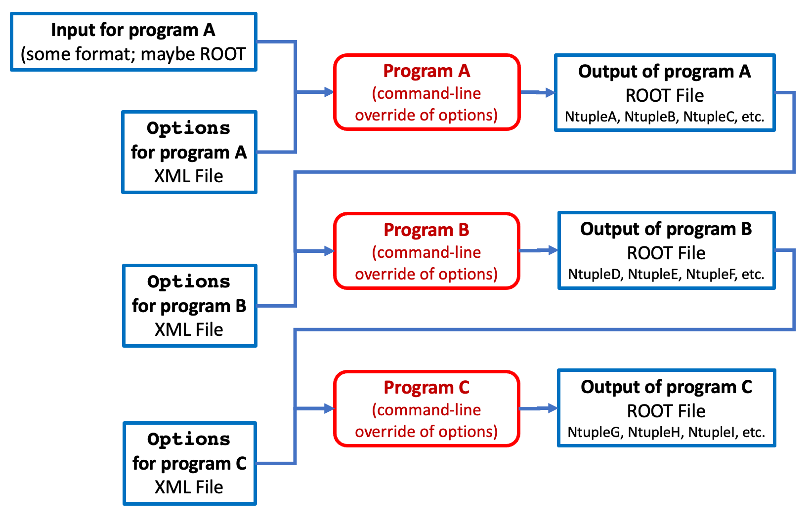
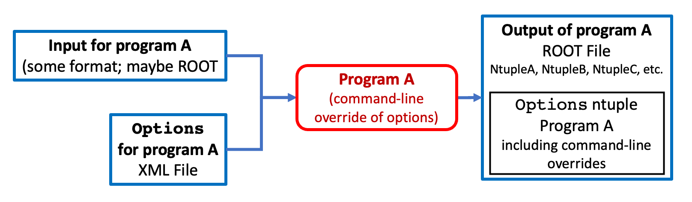
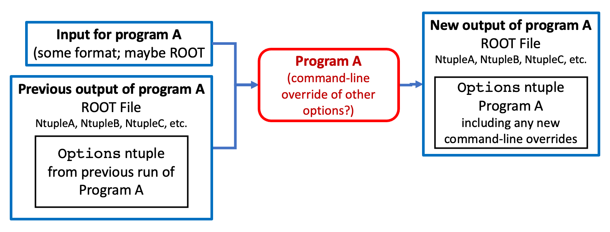
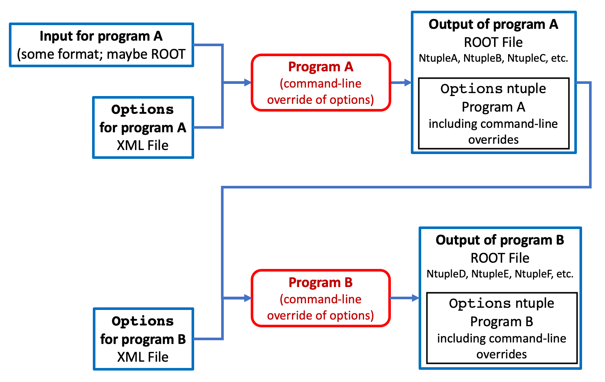
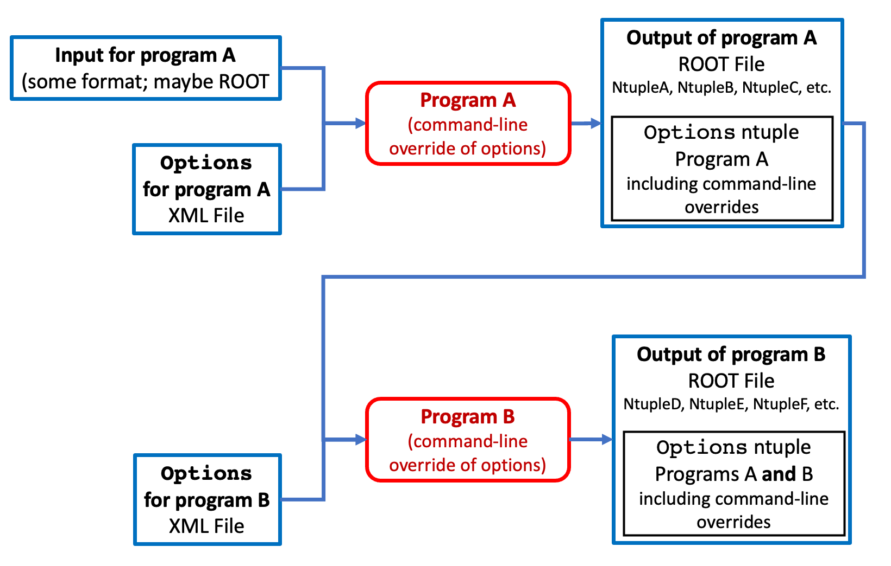
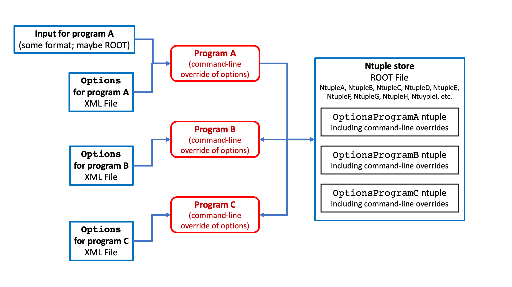

# Directory and Namespace `util`
*Author: [William Seligman](https://github.com/wgseligman)*

_If you want a formatted (or easier-to-read) version of this file, scroll to the bottom of [`GramsSim/README.md`](../README.md) for instructions. If you're reading this on github, then it's already formatted._

This directory contains modules that I find generally useful in the
C++ programs I write. 

- [Directory and Namespace `util`](#directory-and-namespace--util-)
  * [Options - parse XML file and command line](#options---parse-xml-file-and-command-line)
    + [Format of `options.xml`](#format-of--optionsxml-)
      - [Defining new options](#defining-new-options)
        * [Boolean values](#boolean-values)
        * [Flags](#flags)
        * [Vectors](#vectors)
      - [Abbreviating options](#abbreviating-options)
      - [Value Limits](#value-limits)
    + [Accessing options from within your program](#accessing-options-from-within-your-program)
    + [Other `Options` methods](#other--options--methods)
      - [Implementing the `-h/--help` option](#implementing-the---h---help--option)
      - [Displaying a table of all the options](#displaying-a-table-of-all-the-options)
      - [Going through options one-by-one](#going-through-options-one-by-one)
    + [Using `Options` as metadata](#using--options--as-metadata)
      - [Saving options to a ROOT file](#saving-options-to-a-root-file)
      - [Restoring options from a ROOT file](#restoring-options-from-a-root-file)
      - [Preserving options across an analysis chain](#preserving-options-across-an-analysis-chain)
    + [`Options` tips and tricks](#-options--tips-and-tricks)
      - [Documentation options](#documentation-options)
      - [Inspecting the `Options` ntuple](#inspecting-the--options--ntuple)
      - [The `showoptions` script](#the--showoptions--script)
      - [Overriding &lt;global&gt;](#overriding--lt-global-gt-)
      - [Including one XML file from within another](#including-one-xml-file-from-within-another)
      - [The single-file approach](#the-single-file-approach)
  * [Geometry](#geometry)
    + [GDML2ROOT](#-gdml2root--include-geometryh-)
    + [CopyGeometry](#-copygeometry--include-geometryh-)

<small><i><a href='http://ecotrust-canada.github.io/markdown-toc/'>Table of contents generated with markdown-toc</a></i></small>

## Options - parse XML file and command line

One of the most frequent issues that comes up in programming is
getting options and parameters into a program. The purpose of the
`Options` utility is to provide a systematic interface for:

   - Defining and documenting options (handled via the `options.xml` file)
   - Supplying or overriding options using the command line
   - Accessing the options from within a C++ program
   - Saving the options used in particular run of a program

*Although you'll see the text `gramsg4` below, the Options class is generic and can work with any program. Just substitute the program's name for `gramsg4`.*

### Format of `options.xml`

If you look at the file [`options.xml`](../options.xml), what you'll first notice that is that within the `<parameters>` tag there is
more than one section. It looks something like this:

```XML 
<parameters>
  <global>
    <option [...] />
    <option [...] />
  </global>

  <gramssky>
    <option [...] />
    <option [...] />
  </gramssky>

  <gramsg4>
    <option [...] />
    <option [...] />
  </gramsg4>

  <gramsdetsim>
    <option [...] />
    <option [...] />
  </gramsdetsim>
</parameters>
```

The idea is that this same options XML file can be used
by more than one program in an analysis. The `<global>` section
contains parameters that would apply to any program. Individual
programs will have their options in their own sections. For the
purpose of these examples, we're using the name `gramsg4`. If you
created a program with the name `myanalysis`, in the options XML
file you'd have:

```XML
  <myanalysis>
    <option [...] />
    <option [...] />
  </myanalysis>
```

Within these sections there are `option` tags:

```
Anatomy of <option> tag: 

   name  - used on the command line, and by the program
           to fetch the value of the option
           
   short - optional one-character abbreviation for
           a short command-line option
           
   value - the number/text/bool passed to the program;
           can be overridden on the command line

   type  - string/bool/flag/integer/double/vector
   
   desc  - optional; brief description of the option (keep it 
           less than 20 characters); used in the --help|-h message

   low   - optional; the lower allowed limit of 'value'. 

   high  - optional; the upper allowed limit of 'value'.    
```

#### Defining new options

Note that the options in this XML file can be overridden by command-line options.
However, the contents of this file _define_ those command-line options. For example, assume 
this line appears in the XML file:

```XML  
  <option name="energyCut" value="12.5" type="double" desc="muon energy cut [MeV]" />
```

This means that you can set `energyCut` by either editing the XML file, or by using the
option on the command line; e.g.:

    ./gramsg4 --energyCut 15.6

The default name and location of the XML file is "options.xml" in the
current directory. You can override this on the command line; e.g.:

    ./gramsg4 myOptions.xml  

If you're going to use that format, the XML file name must be the
first argument. You can also supply the XML file name via the
`--options` option, e.g.:

    ./gramsg4 --options myWorkDirectory/myOptions.xml

Of course, you can mix and mash to your heart's content:


    ./gramsg4 --energyCut 199.9 --options myEnergyStudyOptions.xml

##### Boolean values

If a job option has `type="boolean"`, then it's a feature that can be
turned on or off. Possible values are `true`, `false`, `on`, `off`,
`0`, `1`.

For example:

```XML  
  <option name="recombination" type="boolean" value="on" desc="turn recombination on/off" />
```  

##### Flags

An option that has `type="flag"` is different from a boolean. A flag takes no arguments on
the command line; either it's there or
it isn't. Examples of a flag are `--verbose` and `--help`.

For example, if this is in the XML file:

```XML  
  <option name="makeHistograms" type="flag" desc="make my special hists"/>
```  

then you could do this on the command line:
 
    ./gramsg4 --makeHistograms --energyCut 123.45
    
In this example, if `--makeHistograms` is present on the command line, the value of the option is `true`; if `--makeHistograms` is not on the command line, the value of the option is `false`.

##### Vectors

As far as Options are concerned, a "vector" is a sequence or tuple of numbers. Here's an example:
```XML
    <option name="direction" value="(0,0,1)" type="vector" desc="initial direction"/>
```
The number format is fairly flexible. 
Any characters that are not part of a numeric format will be ignored. 
All of the following are equivalent:
```XML
    <option name="direction" value="(0.0,0.0,1.0)" type="vector" desc="initial direction"/>
    <option name="direction" value="<0;0;1>" type="vector" desc="initial direction"/>
    <option name="direction" value="[0E20 0 10E-1]" type="vector" desc="initial direction"/>
    <option name="direction" value="+0 -0 1" type="vector" desc="initial direction"/>
    <option name="direction" value="(0nowisthewinterofourdiscontent0,1)" type="vector" desc="initial direction"/>
    <option name="direction" value=".0 .0 .1e1" type="vector" desc="initial direction"/>
```
If you are going to supply a vector on the command line, you'll have
to enclose it in quotes. For example:

    ./gramssky --direction "(0,0.707,-0.707)"

#### Abbreviating options

You can define one-character short options:

```XML
  <option name="energyCut" short="e" value="12.5" type="double" />
```
Then you can do:

    ./gramsg4 -e 123.45 

Be careful not to overuse the short options, since they can make the
command line harder to understand. 

If you duplicate the short character between different options the behavior is
unpredictable. However, case is significant; e.g., you can do this:

```XML
  <option name="energyMin" short="e" value="12.5" type="double" desc="min pion energy [MeV]"/>
  <option name="energyMax" short="E" value="125.0" type="double" desc="max pion energy [Mev]"/>
```  

The usual UNIX shell flexibility is available with these options. Assume these lines are in 
the options XML file. 

```XML
    <option name="verbose" short="v" type="flag" desc="display details"/>
    <option name="nthreads" short="t" value="0" type="integer" desc="number of threads"/>
```

Then all of the following are equivalent:

    ./gramsg4 --nthreads 5 --verbose
    ./gramsg4 -v --nthreads=5
    ./gramsg4 -t 5 --verbose
    ./gramsg4 -vt5

#### Value limits

You can optionally specify the lower and upper limits allowed for a numeric option:

```XML
  <option name="energyMin" value="12.5" low="0" type="double" desc="min pion energy [MeV]" />
  <option name="energyMax" value="125.0" high="1000" type="double" desc="max pion energy [Mev] />
  <option name="energyPeak" value="75" low="5" high="10000" type="double" desc="peak pion energy [Mev]" />
```

Note that the `low` and `high` attributes can be omitted (probably the
most common case), or specified individually if only a lower or an
upper limit is desired.

Realistically, these limits only matter if you specify them for an
option that's likely to passed to the program on the command
line. They form a basic check on potential user errors. For example,
if the program is named `myEnergyProgram`, and given the example
above:

```
./myEnergyProgram --energyPeak 3.6
```

This will result in an error message, and can terminate the program
code (as shown below).

### Accessing options from within your program

Just having an option defined in the XML file is probably not enough.
Some programming is needed to do something with that option. Typically you'd initiate the parsing of the options XML file and the command line by invoking `ParseOptions` in your program's `main` routine. This should only be done once in your program's code. 

The three arguments to `util::Options::ParseOptions` are:

   1. The number of arguments on the command line; normally that is the first argument to the `main` routine (`argc`). 

   2. An array of C-style character strings (or type char**) that contains the arguments on the command line; normally this is the second argument to the main routine (`argv`). The contents of this array will be altered by `ParseOptions`.
 
   3. The third argument can be one of the following:

      - A character string. This should match a tag-block of the same name in the XML file. If the following line of code is used to set up the `Options` routine, then it will only read in the contents of the `<global> ... <\global>` and the `<gramsg4> ... <\gramsg4>` tag blocks:

            auto result = options->ParseOptions(argc, argv, "gramsg4");

      - Omitted. In this case, the name of the executing program (in `argv[0]`) will be used to search for a matching tag-block within the XML file. Any path specifications for the program will be omitted in searching for a tag block; e.g., if you're running `~/grams/GramsSim-work/bin/gramsdetsim` then `ParseOptions` will look for a tag block beginning with `<gramsdetsim>`.

            auto result = options->ParseOptions(argc, argv);

      - The string `"ALL"`. In that case, all the tag blocks will be read in and used. Note that if multiple tag blocks have options with the same `name` attribute, then last one in the file will be used, overriding the ones above it. In the following, all of the tag blocks will be read in (and written by `WriteOptions`; see below):

            auto result = options->ParseOptions(argc, argv, "ALL");

Here is a detailed code example. Again, a reminder: `gramsg4` is just an example name:

```C++
#include "Options.h"
#include <iostream> 
// ...

int main( int argc, char** argv ) {

// ...

//  Parse the contents of the options XML file, with overrides
//  from the command line. 

    auto options = util::Options::GetInstance();
    auto result = options->ParseOptions(argc, argv, "gramsg4");

    // Abort if we couldn't parse the job options.
    if (result) std::cout << "ParseOptions succeeded" << std::endl;
    else {
        std::cerr << "ABORT: File " << __FILE__ << " Line " << __LINE__ << " " 
                << std::endl 
                << "Aborting job due to failure to parse options"
                << std::endl;
        exit(EXIT_FAILURE);
    }
}
```

After that one-time initialization in your `main` routine, you can access the value of a given option from any method:

```C++
#include "Options.h" 
  
  // ...
  
  std::string optionValue; /* ... or int or double or bool ... */
  auto success = util::Options::GetInstance()->GetOption("option-name",optionValue);
  if (success) { ... do whatever with optionValue ... }
  else { there is no option with name "option-name" that is of the type of optionValue }
```  

For example, assume there's a double-precision option defined with the name "energyCut"
in the options XML File:

```C++
#include "Options.h" 
#include <iostream> 
  // ...
  // Save the pointer to the Options object.
  auto options = util::Options::GetInstance();
  // ...
  double myCut;
  auto success = options->GetOption("energyCut",myCut);
  if (success) { 
     ... do whatever with myCut ... 
  }
  else {
    std::cerr << "File " << __FILE__ << " Line " << __LINE__ << " " 
           << std::endl 
           << "There is no floating-point option defined for 'energyCut'"
           << std::endl;
  }

```

To fetch a vector, use `std::vector<double>`; e.g.,
```C++
#include "Options.h" 
#include "TVector3.h"
#include <iostream> 
#include <vector>
// ...
  auto options = util::Options::GetInstance();
  // ...
  std::vector<double> myVector;
  options->GetOption("direction",myVector);
  if ( myVector.size() == 3 ) {
     TVector3 direction(myVector[0], myVector[1], myVector[2]);
     // ...
  }
  else {
     std::cerr << "A direction vector needs exactly three values!" << std::endl;
  }     
```

### Other `Options` methods

#### Implementing the `-h/--help` option

The method `util::Options::PrintHelp()` can be used to implement the `-h` and `--help` options for your program:
```C++
  // Check for help message.
  bool help;
  options->GetOption("help",help);
  if (help) {
    options->PrintHelp();
    exit(EXIT_SUCCESS);
  }
```

This will display all the relevant options in the XML file, along with their descriptions.

For example, using `GramsSim/GramsG4` and `GramsSim/options.xml` as of 2-Dec-2021:
```
$ ./gramsg4 -h
Usage:
  ./gramsg4
    [ -d | --debug ]                    
    [ -g | --gdmlfile <input GDML detector desc> ]
    [ --gdmlout <write parsed GDML to this file> ]
    [ -h | --help ]                     # show help then exit
    [ -i | --inputgen <input generator events> ]
    [ --larstepsize <LAr TPC step size> ]
    [ -m | --macrofile <G4 macro file> ]
    [ -t | --nthreads <number of threads> ]
    [ --options <XML file of options> ] 
    [ -o | --outputfile <output file> ] 
    [ -p | --physicslist <physics list> ]
    [ --rngdir <rng save/restore directory> ]
    [ --rngperevent <rng save per event> ]
    [ --rngrestorefile <restore rng from file> ]
    [ -s | --rngseed <random number seed> ]
    [ --scint <turn on/off scintillation> ]
    [ -l | --showphysicslists ]         # show physics lists then exit
    [ --ui ]                            # start UI session
    [ --uimacrofile <G4 macro file for UI> ]
    [ -v | --verbose ]                  # display details

See options.xml for details.

```

#### Displaying a table of all the options

`util::Options::PrintOptions()` will print all the options and their values as a text table. 
This is handy for debugging. In the case of `gramsg4`, the `PrintOptions()` method is called
if the `--verbose` or `-v` option is turned on:

In the code:

```C++
  bool verbose;
  options->GetOption("verbose",verbose);
  if (verbose) {
    // Display all program options and other details.
    options->PrintOptions();
    // Print other program details.
  }

```

On 2-Dec-2021, the output from `./gramsg4 -v` included:

```
20 options:
Option            short  value                            type       source        desc                
------            -----  -----                            ------     ------        ----                
debug               d    false                            flag       global        
gdmlfile            g    grams.gdml                       string     gramsg4       input GDML detector desc
gdmlout                                                   string     gramsg4       write parsed GDML to this file
help                h    false                            flag       global        show help then exit
inputgen            i                                     string     gramsg4       input generator events
larstepsize              0.020000                         double     gramsg4       LAr TPC step size
macrofile           m    mac/batch.mac                    string     gramsg4       G4 macro file
nthreads            t    0                                integer    gramsg4       number of threads
options                  options.xml                      string     global        XML file of options
outputfile          o    gramsg4                          string     gramsg4       output file
physicslist         p    FTFP_BERT_LIV+OPTICAL+STEPLIMIT  string     gramsg4       physics list
rngdir                                                    string     gramsg4       rng save/restore directory
rngperevent              0                                integer    gramsg4       rng save per event
rngrestorefile                                            string     gramsg4       restore rng from file
rngseed             s    -1                               integer    gramsg4       random number seed
scint                    true                             bool       gramsg4       turn on/off scintillation
showphysicslists    l    false                            flag       gramsg4       show physics lists then exit
ui                       false                            flag       gramsg4       start UI session
uimacrofile              mac/vis-menus.mac                string     gramsg4       G4 macro file for UI
verbose             v    true                             flag       Command Line  display details
```

Note that `Options` keeps track of which tag block was the source of a given option, or if the option came from the command line. 

#### Going through options one-by-one

There are times when it's useful to "iterate" through the internal table of all available options;
for example, to save the options in an ntuple for later reference. The following methods are available (these are the lines from [`Option.h`](include/Option.h)):

```C++
    /// Provide a way to access the "i-th" option stored by this
    /// class. Note that these routines are very inefficient (map
    /// iterators are not random-access) so don't use them inside
    /// frequently-executed loops and such.
    size_t NumberOfOptions() const;
    std::string GetOptionName( size_t i ) const;
    std::string GetOptionValue( size_t i ) const;
    std::string GetOptionType( size_t i ) const;
    std::string GetOptionBrief( size_t i ) const;
    std::string GetOptionDescription( size_t i ) const;
    std::string GetOptionSource( size_t i ) const;
```

### Using `Options` as metadata

The `Options` class offers several methods for saving, restoring, and tracking the values of options in your analysis. For this discussion, consider the following case:

|   |
| :---------------------------------------------: | 
|  <small><strong>Fig 1. A typical use of the `Options` class. Note that in this and the following figures, the options for Program A would be contained in a tag block such as `<programa>...</programa>`; this is omitted from these figures for clarity. </strong></small> |

It's common for set of programs to be organized as a "chain": You run program A, whose output is the input to program B, whose output in turn is used by program C, and so on. For example:

|   |
| :---------------------------------------------: | 
|  <small><strong>Fig 2. An example analysis chain. Each program has its own options. Typically you'd have separate tag blocks within a single XML file, such as `<programa>...</programa> <programb>...</programb> <programc>...</programc>`. However, you could also set up separate XML files for each program if you wished. </strong></small> |

The following methods allow you to keep internal track of the options used for programs A, B, C, etc.; that is, to record the metadata associated with your analysis chain.

Later, you can easily re-run each individual program with the same options, overriding selected options when you need to. 

#### Saving options to a ROOT file

The utility method `WriteOptions` can be used to write the options to an ntuple in an output file in [ROOT](https://root.cern.ch/) format. This lets you record the values used to run the program that generated that particular file.

```C++
#include "Options.h" // in util/ 
// ... call ParseOptions ...
// Define a ROOT output file, e.g.,:
auto output = TFile::Open("output-file-name.root","RECREATE")
// ...
options->WriteNtuple(output);
```

`WriteNtuple` can take a second argument, the name of the options ntuple. If you don't supply one, the default is `Options`. This is a sketch of how that `Options` ntuple is placed within the output file:

|   |
| :---------------------------------------------: | 
|  <small><strong>Fig 3. The effects of using `WriteNtuple`. Note that the `Options` ntuple embedded within the output file will contain the options within the example `<programa>...</programa>` tag block, with the changes from any command-line options. </strong></small> |

#### Restoring options from a ROOT file

Suppose you have a ROOT file that was created by a program that had its options saved using the `WriteOptions` method described above. You'd like to rerun the program with those same options, perhaps with one or more options changed via the command line. Let's further suppose that, due to the complexities of file management over a long analysis, you've lost the original XML options file that generated the ROOT file. 

The `Options` class can automatically recognize ROOT files that are passed to the program in place of an XML file. For example:

    ./gramsdetsim gramsdetsim.root

or

    ./gramsdetsim -v --options gramsdetsim.root

The `ParseOptions` method will search the ROOT file for an ntuple with a name that contains the text `Options`. It will then populate its list of options from that ntuple, and accept any option overrides on the command line. For example:

    ./gramsdetsim -v --options gramsdetsim.root --rho 1.5

Take care! In this particular example, the default output file for `gramsdetsim` is `gramsdetsim.root`. So we're reading our options from the same file to which we're going to write our output; you've overridden the value of `rho` which will be written to the output file. To avoid unpredictable behaviors, you probably want to make sure the files from which you're reading options and to which you're writing output are different:

    ./gramsdetsim -v --options gramsdetsim.root --rho 1.5 --outputfile gramsdetsim-revised.root

|   |
| :---------------------------------------------: | 
|  <small><strong>Fig 4. Using a ROOT file from a previous run to get the options used for that run.  </strong></small> |

#### Preserving options across an analysis chain

If you just use `WriteOptions` as described above, each program's output file will contain an `Options` ntuple that contains just the options used for that run of the program. Consider how this would look for an analysis chain:

|   |
| :---------------------------------------------: | 
|  <small><strong>Fig 5. Using a ROOT file from a previous run to get the options used for that run.  </strong></small> |

Assume you'd like to preserve the options used for all the programs in your analysis chain. For example, if your chain goes from programs A -> B -> C -> D, you'd like to be able to look at the final output from program D and see what options were used in program A. 

Again, this is useful in tracing the history of how a particular file was created, especially if no one kept detailed notes on how the files were created. (We are, of course, referring to files that other researchers created. _You_ always keep notes, but other researchers may not.)

The `Options::CopyInputNtuple` method copies an `Options` ntuple from a ROOT input file and merges it with the options already loaded via the `Options::ParseOptions` method. `CopyInputNtuple` takes as an argument the `TFile*` of a ROOT input file that you've already opened. 

Here's a code fragment to demonstrate how this works:

```C++
#include "Options.h"
#include "TFile.h" // ROOT File class
#include <string>
// ...

int main( int argc, char** argv ) {

    // Parse the contents of the options XML file for the <global>
    // and <programb> blocks, with overrides from the command line. 
    auto options = util::Options::GetInstance();
    auto result = options->ParseOptions(argc, argv, "programb");
    
    // For this example, assume the option that specifies the ROOT input 
    // file is "inputfile".
    std::string inputFileName;
    options->GetOption("inputfile",inputFileName);
    
    // Open the ROOT input file. Note that ROOT requires that
    // its string be converted into C-style strings; it can't
    // handle std::string objects as arguments. 
    auto input = new TFile(inputFileName.c_str());

    // Merge the options from the input file, to provide a historical
    // record of the analysis chain.
    options->CopyInputNtuple(input);

    // Open the ROOT output file for this program. Assume
    // the option for the output file name is "outputfile".
    std::string outputFileName;
    options->GetOption("outputfile",outputFileName);

    // "RECREATE" means to open the file for writing, and to create a
    // brand-new output file (as opposed to appending to an old one).
    auto output = new TFile(outputFileName.c_str(),"RECREATE");

    // Write all the options to the output file in order to preserve them.
    options->WriteNtuple(output);

    // ... do the rest of the program's processing ...
}
```

Here a sketch of the result:

|   |
| :---------------------------------------------: | 
|  <small><strong>Fig 6. A sketch of how `CopyInputNtuple` works. </strong></small> |

For example, in the `GramsSim` analysis chain, the order of the programs is `gramssky` -> `gramsg4` -> `gramsdetsim` -> `gramsreadoutsim` -> `gramselecsim`. Each of these programs uses `CopyInputNtuple` to merge the previous programs' options into its own. These are the first 50 rows in the resulting `Options` ntuple in the output of the final program in the chain:

```
******************************************************************************************************************
*    Row   * OptionName.OptionNam * OptionValue.Opt * OptionTy * O *     OptionDesc.OptionDesc * OptionSource.Op *
******************************************************************************************************************
*        0 *      DriftCoordinate *               2 *  integer *   * direction of electron dri *     gramsdetsim *
*        1 *        ElectricField *        1.000000 *   double *   *    electric field [kV/cm] *     gramsdetsim *
*        2 *  ElectronClusterSize *             200 *  integer *   * number of electrons in a  *     gramsdetsim *
*        3 * ElectronDriftVelocit *        0.010000 *   double *   *    drift velocity (cm/ns) *     gramsdetsim *
*        4 * ElectronLifeTimeCorr *    50000.000000 *   double *   * mean life of electrons (n *     gramsdetsim *
*        5 *           EnergyUnit *             MeV *   string *   * energy unit for program o *          global *
*        6 *           LArDensity *        1.397300 *   double *   *      LAr density [g/cm^3] *     gramsdetsim *
*        7 *           LengthUnit *              cm *   string *   * length unit for program o *          global *
*        8 * LongitudinalDiffusio *        0.000000 *   double *   *                 [cm^2/ns] *     gramsdetsim *
*        9 *       MeVToElectrons *    42370.000000 *   double *   * the number of generated e *     gramsdetsim *
*       10 * MinNumberOfElCluster *               0 *  integer *   * minimum number of cluster *     gramsdetsim *
*       11 *    ReadoutPlaneCoord *        0.000000 *   double *   * location of readout plane *     gramsdetsim *
*       12 *   RecombinationModel *               0 *  integer *   *       recombination model *     gramsdetsim *
*       13 *             TimeUnit *              ns *   string *   * time unit for program out *          global *
*       14 *  TransverseDiffusion *        0.000000 *   double *   *                 [cm^2/ns] *     gramsdetsim *
*       15 *           absorption *               1 *  boolean *   *  model absorption effects *     gramsdetsim *
*       16 *             birks_AB *        0.806000 *   double *   *   factor for Birk's model *     gramsdetsim *
*       17 *             birks_kB *        0.052000 *   double *   * factor for Birk's model [ *     gramsdetsim *
*       18 *       bit_resolution *              10 *  integer *   *   resolution of ADC [bit] *    gramselecsim *
*       19 *            box_alpha *        0.930000 *   double *   *    recombination constant *     gramsdetsim *
*       20 *             box_beta *        0.212000 *   double *   * recombination constant [( *     gramsdetsim *
*       21 *                debug *               0 *     flag * d *                           *          global *
*       22 *            diffusion *               1 *  boolean *   *   model diffusion effects *     gramsdetsim *
*       23 *             gdmlfile *      grams.gdml *   string * g *  input GDML detector desc *         gramsg4 *
*       24 *              gdmlout *                 *   string *   * write parsed GDML to this *         gramsg4 *
*       25 *                 help *               0 *     flag * h *       show help then exit *          global *
*       26 *            input_max *     1000.000000 *   double *   * maximum input of ADC [mV] *    gramselecsim *
*       27 *            input_min *        0.000000 *   double *   * minimum input of ADC [mV] *    gramselecsim *
*       28 *            inputfile * gramsreadoutsim *   string * i *                input file *    gramselecsim *
*       29 *             inputgen *                 *   string * i *    input generator events *         gramsg4 *
*       30 *          inputntuple *      ReadoutSim *   string *   *              input ntuple *    gramselecsim *
*       31 *          larstepsize *        0.020000 *   double *   *         LAr TPC step size *         gramsg4 *
*       32 *            macrofile *   mac/batch.mac *   string * m *             G4 macro file *         gramsg4 *
*       33 *         noise_param0 *        0.000000 *   double *   *                 0th order *    gramselecsim *
*       34 *         noise_param1 *        0.000000 *   double *   *                 1st order *    gramselecsim *
*       35 *         noise_param2 *        0.000000 *   double *   *                 2nd order *    gramselecsim *
*       36 *             nthreads *               0 *  integer * t *         number of threads *         gramsg4 *
*       37 *              options *     options.xml *   string *   *       XML file of options *          global *
*       38 *           outputfile * gramselecsim.ro *   string * o *               output file *    gramselecsim *
*       39 *         outputntuple *         ElecSim *   string *   *             output ntuple *    gramselecsim *
*       40 *           peak_delay *        0.000000 *   double *   *   delay time from e- [ns] *    gramselecsim *
*       41 *          physicslist * FTFP_BERT_LIV+O *   string * p *              physics list *         gramsg4 *
*       42 *          pixel_sizex *        3.200000 *   double *   *              pixel size x * gramsreadoutsim *
*       43 *          pixel_sizey *        3.200000 *   double *   *              pixel size y * gramsreadoutsim *
*       44 *          preamp_func *               4 *  integer *   * curve type of preamp outp *    gramselecsim *
*       45 *          preamp_gain *        1.000000 *   double *   *              gain [mV/fC] *    gramselecsim *
*       46 *            preamp_mu *     1500.000000 *   double *   *       sampling width [ns] *    gramselecsim *
*       47 *     preamp_post_time *     3000.000000 *   double *   *           decay time [ns] *    gramselecsim *
*       48 *    preamp_prior_time *      200.000000 *   double *   *            rise time [ns] *    gramselecsim *
*       49 *         preamp_sigma *      400.000000 *   double *   *       sampling width [ns] *    gramselecsim *

```

Notes on the above table:

   - The options are sorted in alphabetical order. In the standard ASCII sorting of characters, capital letters come before lower-case letters. 
   
   - See the **Inspecting the `Options` ntuple** section below for how to generate this table for your own options. 
   
   - Some of the columns' names are cut off in the above display. Here are the full names:
      - `OptionName`
      - `OptionValue` - This is always stored as a string, even if the value is numeric.  
      - `OptionType`
      - `OptionBrief` - The single-letter abbreviation that can be used on the command line.
      - `OptionDesc`
      - `OptionSource`
   
   - The final column, `OptionSource`, keeps track of the XML tag block that was original source of the option. Exception: If the value of the option was overridden on the command line, the value of `OptionSource` will be `"Command line"`.

If two different programs have an option with the same name, the most downstream value of the option within the analysis chain is the one that's kept; in other words, `CopyInputNtuple` will not override an option read by `ParseOptions`. For the most part, this will affect options with common names like `inputfile` and `outputfile`. If it's important to track the inputs and outputs in the analysis chain, give the options different names for each program like `inputProgramA` or `outputProgramB`.

### `Options` tips and tricks

The following sections discuss aspects of using `Options` that don't directly involve C++ programming. 

#### Documentation options

A "documentation option" is one that's not actually used by any program, but is copied via the `CopyInputNtuple` and `WriteNtuple` methods from one file to another in the analysis. This can be used to describe the reason why the program/job/analysis chain is being run.

For example, assume this option is in the `<global>` section of the XML file:

```XML
 <option name="comment" type="string" value="" desc="document purpose of run" />
```

Then you can run a program with a value for that option, to document what you're doing; e.g.,

    ./gramsg4 --comment "03-Nov-2022 understand energy calibration"
    
#### Inspecting the `Options` ntuple

The simplest way to inspect the values stored in the `Options` ntuple is to use ROOT interactively. For example, assume you wish to know the value of the options stored in file `myOutput.root`:

```
# Set up ROOT as appropriate for your system, then:
root myOutput.root
# Within interactive ROOT
Options->Scan()
```

By default, `TTree::Scan()` displays all the columns with the same width, which is not convenient for the `Options` ntuple. The following command adjusts the output column widths as shown in the table above; you can just copy-and-paste the following in your interactive ROOT session:

```
Options->Scan("","","col=20:15:8:1:25:15")
```

For more tips on using `Scan`, see the documentation for [`TTreePlayer::Scan`](https://root.cern.ch/doc/master/classTTreePlayer.html#aa0149b416e4b812a8762ec1e389ba2db) on the ROOT web site. For example, to route the output of `Scan` to an external file:

```
Options->SetScanField(1000)
.> options.txt
Options->Scan("","","col=20:15:8:1:25:15")
.>
```

#### The `showoptions` script

For a non-interactive display of the options ntuple, there is a Python 3 script [`showoptions`](showoptions) which is normally installed in the `bin/` sub-directory of your project. Typically you use this script with one argument: the name of the ROOT file that contains an `Options` ntuple; e.g.,

    ./bin/showoptions myoutput.root
    
If your options ntuple doesn't have the name `Options`, or you have more than one options ntuple in your output file (see **The single-file approach** below) then supply the name of the your ntuple as a second argument; e.g.,

    ./bin/showoptions myoutput.root OptionsProgramB

#### Overriding &lt;global&gt;

Suppose you had something like this in the options XML file:

```XML
<parameters>
  <global>
    <option name="myoption" value="value1" ... />
  </global>

  <myprogram>
    <option name="myoption" value="value2" ... />
  </myprogram>
</parameters>
```

Then for every other program that uses the Options class, the value of `myoption` would be `value1`. But for the program `myprogram`, the value of `myoption` would be `value2`.

This is not a good practice. It's probably better to use the command line for this sort of override; e.g.,
```
./myprogram --myoption=value2
```

#### Including one XML file from within another

Perhaps you are focussed on a particular set of options associated with one program and don't care about any other
program's options. Or perhaps the default [`options.xml`](../options.xml) file seems too long and scrolling through it
takes a long time. 

In these cases, you can include a section of one XML file within another using [XInclude][70]. The basic recipe is:

[70]: https://www.xml.com/pub/a/2002/07/31/xinclude.html

   - For the main file (the one that's doing the including):

      - Include the xinclude specification in the opening `<parameters>` tag:
   
          `<parameters xmlns:xi="http://www.w3.org/2001/XInclude">`
          
      - Specify the file and the id of the tag to be included. In this example, the
      section with the tag `gramssky` in file [`GramsSky/options.xml`](../GramsSky/options.xml)
      is to be included.
      
          `<xi:include href="GramsSky/options.xml" element="gramssky"/>`
                    
   - For the file whose contents will be included:
   
      - In the program-options section you want to include, add an `xml:id` attribute with the id you supplied as the value of the `element` attribute in the main file, e.g.,
      
          `<gramssky xml:id="gramssky">`
          
      - This may not be necessary if the value of the `element` attribute in the main file is the same as the tag
      with the program's name (`gramssky` in this example). 

#### The single-file approach

Depending on the needs of an analysis, the best choice may be to keep the options associated with each individual program separate, rather than merging them all via `CopyInputNtuple` over successive programs in an analysis chain. One approach is to use a single file to hold all the outputs of all the programs, instead of each program having a separate output file. 

The simplest way to do this is to open a file with `"UPDATE"` access:

    auto theFile = new TFile(filename.c_str, "UPDATE");
    
Then anything new written to the ROOT file is appended to its existing contents, instead of the file being replaced as it would be for `"RECREATE"` access. 

In use this approach:

- When using the `Options::WriteNtuple` method, include the second argument to specific the name of the output ntuple to record the program's options; e.g.,

        options->WriteNtuple(theFile, "OptionsProgramA");

   - If you omit the second argument and use the default name of `"Options"`, they'll be appended to the file as `Options;1`, `Options;2`, etc. It may be difficult to remember which of the cycles of the `Options` ntuple applies to which program. 
   
   - It's not a good idea to combine this with `Options::CopyInputNtuple`. The point of this approach is to avoid merging the options ntuples, which is what `CopyInputNtuple` does.
   
- Since all the other ntuples written by the various programs will be appended to the same file, even if each program's ntuple has a different name, to save space it may be worth considering [TTree friends](https://root.cern.ch/doc/master/treefriend_8C.html) to avoid duplicating columns between different ntuples. 

   For example, assume ntuple `NtupleA` has one row for each (run,event,trackID), and ntuples `NtupleB`, `NtupleC`, `NtupleD`, etc., also have a row-for-row correspondence for (run,event,trackID). Then declaring `NtupleB`, `NtupleC`, etc., as friends of `NtupleA` means that you don't have to store (run,event,trackID) in the additional ntuples. They only have to contain the new columns being created by a particular program. 
   
- A reminder that you probably want the first program in the analysis to create the single ROOT file with `"RECREATE"` access.
   
Here's a sketch of the idea:

|   |
| :---------------------------------------------: | 
|  <small><strong>Fig 7. A sketch of the single-file approach for managing program output ntuples, including the programs' options. </strong></small> |

## Geometry

The `Geometry` utility class contains methods that are of use in working with ROOT-based [TGeoManager][2020] detector geometries.

[2020]: https://root.cern.ch/doc/master/classTGeoManager.html

### GDML2ROOT

By default, this method makes use of parameters in [`options.xml`](../options.xml). It takes the GDML detector description saved in the file specified by the `gdmlout` parameter, converts it into a ROOT `TGeoManager` geometry, and appends the model to the ROOT file specified in the `outputfile` parameter, with the name given by the `geometry` parameter.

A concrete example: Assume

   - `gdmlout` = `parsed.gdml`
   - `outputfile` = `gramsg4.root`
   - `geometry` = `GRAMSgeometry`
   
Then when `util::Geometry::GDML2ROOT()` is executed, it will convert the GDML code in `parsed.gdml` into ROOT form, and append it to `gramsg4.root` as a `TGeoManager` object named `GRAMSgeometry`.

Typically, this method would be used at the end of a simulation, after all Geant4 files have been closed.

_Note: It's possible to use a separate ROOT file instead of a GDML file as the intermediate geometry file by giving the `gdmlout` parameter a file name that ends in `.root` instead of `.gdml`; the various Geant4 and ROOT routines will automatically switch the model's interpretation based on the extension. The advantage of using GDML for this intermediate file is that the GDML is more human-readable._

The full signature of the `GDML2ROOT` method is:

```
    bool GDML2ROOT( std::string gdmlFile = "",
                    std::string rootFile = "",
                    std::string geometry = "" );
```

By supplying appropriate values for these arguments, you can append any `.gdml` or `.root` geometry file into another `.root` file with any name you choose.

### CopyGeometry

After the simulation, in subsequent job steps it's handy to copy the `TGeoManager` description from the input file to the output file. In that way, every file in the analysis chain can have a record of the geometry used to generate its output.

_While it might initially seem that this is a waste of disk space, the `TGeoManager` description of a detector like GRAMS is only ~200K, while a typical output file is 50M or more. The ability to track the "archeology" of a given file is probably worth making files a trifle larger._

The full signature of `CopyGeometry` is:

```
    std::shared_ptr<TGeoManager> CopyGeometry(const TDirectory* input, 
                                              TDirectory* output, 
                                              std::string geometry = "");
```

The typical use of `CopyGeometry` is:

   - Open the input file; assume the name of `TFile` variable is `inputfile`.
   - Open the output file; assume the name of the `TFile` variable is `outputfile`.
   - Assume the name of the geometry is the same as that of `geometry` parameter in the [`options.xml`](../options.xml) file.
   
Then to copy the geometry from the input file to the output file, use:

```
  auto geometry = util::Geometry::GetInstance();
  geometry->CopyGeometry(inputfile,outputfile);
```

If you need to access the `TGeoManager` object that is being copied, modify the second line to read something like:

```
  auto myGeometry = geometry->CopyGeometry(inputfile,outputfile);
```

You might use the third argument to `CopyGeometry` if more than one detector description is in the same file, or the name of the geometry you want doesn't match the parameter in `options.xml`.
